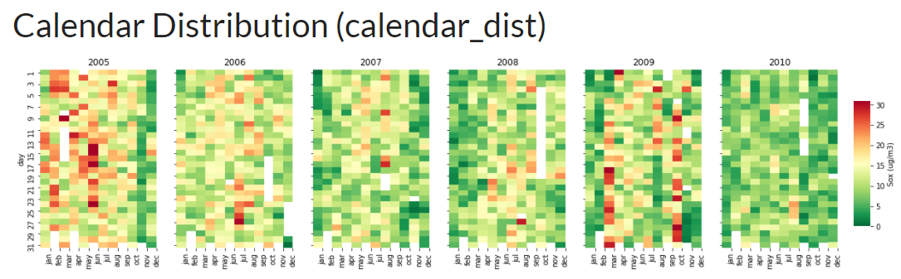

# Види представлення даних якості повітря

## Розподіл типу календар

* [Air Pollution Analysis using Python | Analyse Air Pollution](https://www.analyticsvidhya.com/blog/2021/07/how-to-analyse-air-pollution-using-python/)

## Блокноти з аналізом даних

* [Jupyter notebooks and Python code for analyzing air quality (fine particle, PM2.5)](https://binh-bk.github.io/air-quality-analysis/)

## Власні ідеї

1. HeatMap, вісі: x - години доби, y - дні тижня; клітинка: середнє (медіанне) значення фактору f(x, y) за обраний період часу

1. HeatMap на карті міста за обраний період часу,  
