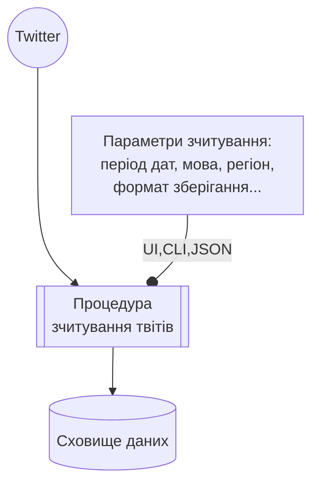

# Робочі блок-схеми

## Зчитування твітів

```mermaid
flowchart TD
        A((Twitter))
        B[[Процедура<br>зчитування твітів]]
        C[Параметри зчитування:<br>період дат, мова, регіон,<br>формат зберігання...]
        D[(Сховище даних)]
        A ---> B
        B --> D
        C --o |UI,CLI,JSON| B
```

