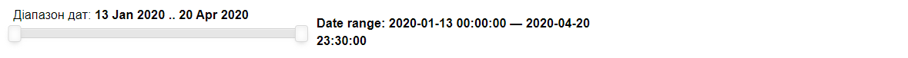
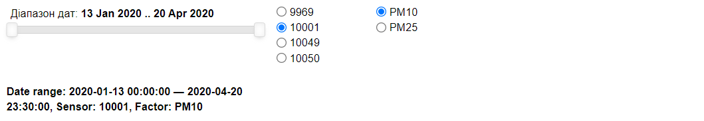
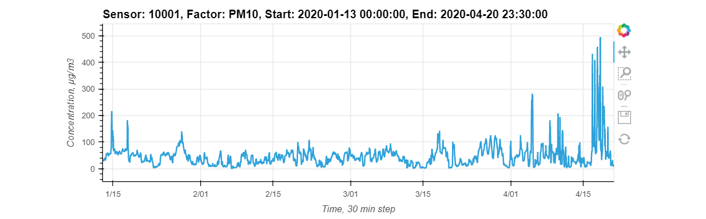
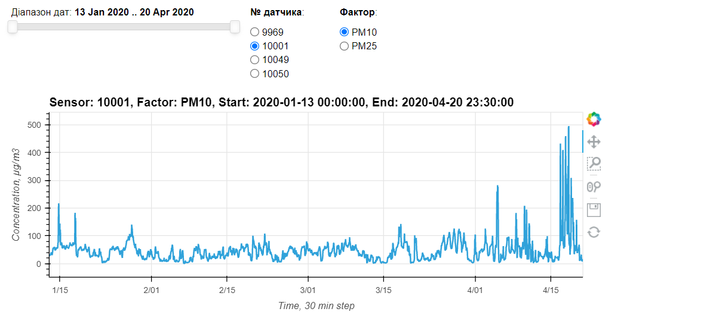

# Демонстрація інтерактивних даних

> Дані - це викопний ресурс у сучасному світі. Відповідно, технологічність видобування даних (data mining) є запорукою успіху в знаходженні своєї золотої жили. 


Ця демонстрація працює в середовищі *Jupyter Notebook* або на локальному комп'ютері або на платформі *Colab*.

У випадку запуску на локальному комп'ютері передбачається, що у вас попередньо встановлені:

- *Python*,
- віртуальний простір (з допомогою *Anaconda*),
- а також модулі `Panel` і `Holoviews`.

Останнє я зробив одним заходом, [встановивши пакет модулів `Holoviz`](https://oleghbond.medium.com/повний-цикл-дослідження-даних-власноруч-d584b01d08e6#3113).

## Читаємо дані

Це блок спрощеного читання даних. В подальшому він може бути замінений інтерфейсом з БД.

У нашому випадку дані представлені у форматі *long* або *tabular* (на противагу *wide* або *gridded* - докладніше про форми представлення даних [тут](https://oleghbond.medium.com/long-or-wide-637ed065d983#7704)). Зважте на те, що форма представлення даних важлива для подальшого поводження з ними, зокрема методами візуалізації.

До того ж у цьому блоці генеруються додаткові поля, похідні від поля `time` для подальшої обробки та представлення даних.

```python
import pandas as pd
from datetime import datetime

def read_data():
    data_file = 'https://raw.githubusercontent.com/protw/airscape/master/' + \
                'data/200421%20Chronograf%20Data.csv'
    df = pd.read_csv(data_file)
    df.time = [datetime.strptime(x[0:19],'%Y-%m-%dT%H:%M:%S') for x in df.time]
    df['dayhour'] = [x.hour for x in df.time]
    df['weekday'] = [x.weekday() for x in df.time]
    df['monthday']= [x.day for x in df.time]
    df['yearday'] = [x.timetuple().tm_yday for x in df.time]
    df['yearweek']= [x.isocalendar()[1] for x in df.time] 
    df['month']   = [x.month for x in df.time] 
    df['year']    = [x.year for x in df.time]
    return df

df = read_data()
```

```python
df.info()
```

**Output:**


```
<class 'pandas.core.frame.DataFrame'>
RangeIndex: 38016 entries, 0 to 38015
Data columns (total 11 columns):
 #   Column     Non-Null Count  Dtype         
---  ------     --------------  -----         
 0   time       38016 non-null  datetime64[ns]
 1   sensor_id  38016 non-null  int64         
 2   val        32266 non-null  float64       
 3   factor     38016 non-null  object        
 4   dayhour    38016 non-null  int64         
 5   weekday    38016 non-null  int64         
 6   monthday   38016 non-null  int64         
 7   yearday    38016 non-null  int64         
 8   yearweek   38016 non-null  int64         
 9   month      38016 non-null  int64         
 10  year       38016 non-null  int64         
dtypes: datetime64[ns](1), float64(1), int64(8), object(1)
memory usage: 3.2+ MB
```

## Параметри даних

Обраховуємо параметри даних - мінімальні та максимальні значення, а також для полів з обмеженою кількістю дискретних значень - перелік унікальних значень - до словника `params`.

```python
params = {
    'factors': sorted(df.factor.unique()),
    'sensors': sorted(df.sensor_id.unique()),
    'time': [df.time.min(), df.time.max()],
    'values': [df.val.min(), df.val.max()],
    'hours_in_day': sorted(df.dayhour.unique()),
    'days_in_week': sorted(df.weekday.unique()),
    'days_in_month': sorted(df.monthday.unique()),
    'day_in_year': sorted(df.yearday.unique()),
    'week_in_year': sorted(df.yearweek.unique()),
    'month_in_year': sorted(df.month.unique())
}
```

```python
for k,v in params.items():
  print(f'{k} = {v}')
```

**Output:**

```
factors = ['PM10', 'PM25']
sensors = [9969, 10001, 10049, 10050]
time = [Timestamp('2020-01-13 00:00:00'), Timestamp('2020-04-20 23:30:00')]
values = [0.0, 518.033788]
hours_in_day = [0, 1, 2, 3, 4, 5, 6, 7, 8, 9, 10, 11, 12, 13, 14, 15, 16, 17, 18, 19, 20, 21, 22, 23]
days_in_week = [0, 1, 2, 3, 4, 5, 6]
days_in_month = [1, 2, 3, 4, 5, 6, 7, 8, 9, 10, 11, 12, 13, 14, 15, 16, 17, 18, 19, 20, 21, 22, 23, 24, 25, 26, 27, 28, 29, 30, 31]
day_in_year = [13, 14, 15, 16, 17, 18, 19, 20, 21, 22, 23, 24, 25, 26, 27, 28, 29, 30, 31, 32, 33, 34, 35, 36, 37, 38, 39, 40, 41, 42, 43, 44, 45, 46, 47, 48, 49, 50, 51, 52, 53, 54, 55, 56, 57, 58, 59, 60, 61, 62, 63, 64, 65, 66, 67, 68, 69, 70, 71, 72, 73, 74, 75, 76, 77, 78, 79, 80, 81, 82, 83, 84, 85, 86, 87, 88, 89, 90, 91, 92, 93, 94, 95, 96, 97, 98, 99, 100, 101, 102, 103, 104, 105, 106, 107, 108, 109, 110, 111]
week_in_year = [3, 4, 5, 6, 7, 8, 9, 10, 11, 12, 13, 14, 15, 16, 17]
month_in_year = [1, 2, 3, 4]
```

## Будуємо інтерактивні елементи управління

Спочатку імпортуємо потрібний модуль `Panel` та ініціюємо його.

```python
import panel as pn
pn.extension()
```

### Слайдер для діапазону дат

Спочатку конструюємо об'єкт слайдера `date_range_slider` з допомогою віджета `DateRangeSlider` (див. [документацію](https://panel.holoviz.org/reference/widgets/DateRangeSlider.html)). Використовуючи словник `params` задамо параметри початку `start` і кінця `end` часового діапазону, а також початкові значення лівого і правого двигунця через кортеж `value`.

```python
date_range_slider = pn.widgets.DateRangeSlider(
    name='Діапазон дат',
    start=params['time'][0], end=params['time'][1],
    value=(params['time'][0], params['time'][1])
)
```

Створюємо функцію `datetime_print`, що повертає текстовий рядок зі значеннями початку і кінця часового діапазону.

З допомогою декоратора `@pn.depends` призначаємо функцію `datetime_print` як *callback*, що викликається у разі змін у значеннях в об'єкті слайдера `date_range_slider`.

```python
@pn.depends(date_range_slider.param.value)
def datetime_print(dt):
  return f'#### Date range: {dt[0]} — {dt[1]}'
```

З допомогою `Row` виводимо список об'єктів `[date_range_slider, datetime_print]` в рядок. У підсумку бачимо: ліворуч - слайдер, праворуч - друковані результати крайніх значень діапазону.

Одразу перевіримо роботу нашої композиції - рухаємо двигунці слайдера і спостерігаємо відповідні зміни друкованих результатів.

```python
pn.Row(date_range_slider, datetime_print)
```

**Output:**



### Складніший приклад

Тепер об'єднаємо декілька елементів управління на одній панелі, додавши дві радіо-групи `RadioBoxGroup`: для вибору номера датчика `sensor_radio` і для вибору фактору забруднення `factor_radio`.

```python
sensor_radio = pn.widgets.RadioBoxGroup(name='SensorRadio', options=params['sensors'], inline=False, width=100)
factor_radio = pn.widgets.RadioBoxGroup(name='FactorRadio', options=params['factors'], inline=False, width=100)
```

З допомогою декоратора `@pn.depends` призначаємо функцію `info_print` як *callback*, що викликається у разі змін у значеннях декількох об'єктів `date_range_slider`, `sensor_radio` і `factor_radio`.

```python
@pn.depends(date_range_slider.param.value, sensor_radio.param.value, factor_radio.param.value)
def info_print(dt,s,f):
    return f'#### Date range: {dt[0]} — {dt[1]}, Sensor: {s}, Factor: {f}'
```

Цього разу макет розташування створених об'єктів зробимо трохи складнішим з допомогою методів `Row` і `Column`:

- спочатку викладемо три об'єкти управління параметрами `date_range_slider`, `sensor_radio` і `factor_radio` в один рядок `param_panel`;
- потім вибудуємо панель `param_panel` і блок відображення `info_print` у одну колонку.

Одразу перевіримо роботу цієї композиції та спостерігаємо відповідні зміни друкованих результатів.

```python
param_panel = pn.Row(date_range_slider, sensor_radio, factor_radio)
pn.Column(param_panel, info_print)
```

**Output:**



## Візуалізуємо дані з обраними параметрами

```python
drs, sns, fct = date_range_slider.value, sensor_radio.value, factor_radio.value
```

```python
import holoviews as hv
from holoviews import opts

hv.extension('bokeh')
```

**Output:**


Визначаємо набір даних, а саме: незалежні змінні - `kdims` і залежні змінні - `vdims`. Кожна змінна визначається кортежем: перший елемент - назва поля з датафрейму, другий елемент - опис змінної для підпису вісі.

```python
dataset = hv.Dataset(df, 
                     kdims=[('sensor_id','Sensor #'),
                            ('time','Time, 30 min step'),
                            ('yearday','Day of a year'),
                            ('dayhour','Hour of a day'),
                            ('factor','Pollution factor')],
                     vdims=('val','Concentration, µg/m3'))
```

Декларуємо oб'єкт класу `Curve`. Одночасно фільтруємо набір даних `dataset` з допомогою `.select()`:

- до змінної `time` подаємо кортеж `drs`, що означає фільтрацію по стовпчику `time` діапазону `(drs[0], drs[1])`;
- до змінної `sensor_id` додаємо список `sns` (обраний зі списку `sensor_radio.options`, що заданий через `params['time']`), що означає фільтрацію даних за цим списком;
- аналогічно, до змінної `factor` додаємо список `fct` (обраний зі списку `factor_radio.options`, що заданий через `params['factors']`), що означає фільтрацію даних за цим списком.

Аргумент `kdims` визначає незалежну змінну. Аргумент `label` визначає напис над діаграмою.

```python
curve = hv.Curve(dataset.select(time=drs, sensor_id=sns, factor=fct),
                 kdims='time', label=f'Sensor: {sns}, Factor: {fct}, ' +
                 f'Start: {drs[0]}, End: {drs[1]}')
```

Переважну більшість параметрів можна задати або скорегувати з допомогою метода `.opts(opts.Curve(...))`. Повний перелік можливих аргументів можна переглянути через запуск рядка `hv.help(hv.Curve)`.

```python
curve.opts(opts.Curve(width=800, show_grid=True, xlabel='Time, 30 min step'))
```

З допомогою `Row` виводимо відображення об'єкту діаграми `curve`:

```
pn.Row(curve)
```



## Компонуємо інтерактивну візуалізацію

Скористаємось за аналогією побудованою вище функцією `info_print` лише з тією різницею, що замість друку значень побудуємо діаграму `info_viz` з прив'язкою її відображення до змін в інтерактивних елементах управління.

```python
@pn.depends(date_range_slider.param.value, sensor_radio.param.value,
            factor_radio.param.value)
def info_viz(drs,sns,fct):
  curve = hv.Curve(dataset.select(time=drs, sensor_id=sns, factor=fct),
                   kdims='time', label=f'Sensor: {sns}, Factor: {fct}, ' +
                   f'Start: {drs[0]}, End: {drs[1]}')
  curve.opts(opts.Curve(width=800, show_grid=True, xlabel='Time, 30 min step'))
  return curve
```

На жаль не вдалося знайти атрибутів написів для радіогруп, щоб позначали візуально таку групу. Тому додамо окремі написи груп радіо-кнопок з допомогою віджета `.StaticText`, а потім кожний напис скомпонуємо з радіогрупою у стовпчик з допомогою `pn.Column`.

```python
sensor_radio_label = pn.widgets.StaticText(name='№ датчика', value='', width=100)
factor_radio_label = pn.widgets.StaticText(name='Фактор', value='', width=100)

param_panel = pn.Row(date_range_slider, pn.Column(sensor_radio_label, sensor_radio),
                     pn.Column(factor_radio_label, factor_radio))
```

## Запуск візуалізації

### У блокноті

Після виконання наступного рядка в блокноті у ньому ж з'явиться проста панель управління переглядом даних, де ви можете обирати діапазон дат, № датчика і фактор моніторингу.

```python
pn.Column(param_panel, info_viz)
```

**Output:**



### У блокноті як веб-застосунок

Після виконання наступного рядка у вашому блокноті з'явиться посилання `http://localhost:12346`, після переходу за яким ваш код запуститься як веб-застосунок в окремій вкладці бравзера, але лише на вашому комп'ютері.

```python
bokeh_server = pn.Column(param_panel, info_viz).show(port=12346)
```

**Output:**

```
Launching server at http://localhost:12346
```

### Як серверний веб-застосунок

Для цієї вправи я підготував цей код, видаливши з нього всі проміжні навчально-демонстраційні фрагменти, і зберіг його як [блокнот з дещо модифікованим іменем `interact_data_demo_serv.ipynb`](https://github.com/protw/airscape/blob/master/stavok/interact_data_demo_serv.ipynb).

Подальші дії проводимо вже на своєму комп'ютері:

- Перейдемо до фолдеру, де збережений блокнот `interact_data_demo_serv.ipynb`.

- Виберемо з допомогою *conda* потрібний нам віртуальний простір - у нашому випадку, наприклад, *airscape* і запустимо наш застосунок як сервер:

  ```
    (base)> activate airscape
    (airscape)> panel serve interact_data_demo_serv.ipynb
  ```

- Після цього нам буде запропоновано перейти в браузер і запустити застосунок з рядка веб-адреси:

  ```
    http://localhost:5006/interact_data_demo_serv
  ```

Після запуску застосунку у бравзері ви отримаєте ту саму просту панель управління переглядом даних, але вже в окремому вікні (без перегляду коду).

Для виходу у відкритий космос інтернету вам залишається знайти сервер або сервіс, де ви зможете розгорнути і запустити ваш застосунок. Але цю задачу ми залишаємо на наступні кроки...

## Підсумок (що нам вдалося)

1. Нам вдалося побудувати демонстрацію простого циклу поводження з даними: зчитування, обробка, відображення. 
2. Ми побудували простий веб-застосунок у формі блокнота *Jupyter* - панель управління переглядом даних. У подальшому можна управляти також зчитуванням, додавати методи обробки і форми представлення даних.
3. Веб-застосунок можна запускати у декількох варіантах: 
   - як блокнот на *Colab* - цей варіант зручний для командної роботи або для публічного представлення результатів; також він не потребує встановлення *Python*;
   -  як блокнот на своєму комп'ютері - підходить для відлагодження процедур і представлення даних;
   - у двох перших випадках застосунок можна запускати в окремій закладці бравзера без перегляду даних - цей варіант зручний для "гри" з даними;
   - як окремий сервіс на сервері або сервісі, де ви зможете розгорнути і запустити ваш застосунок - цей варіант підходить для створення кінцевого продукту для споживачів.