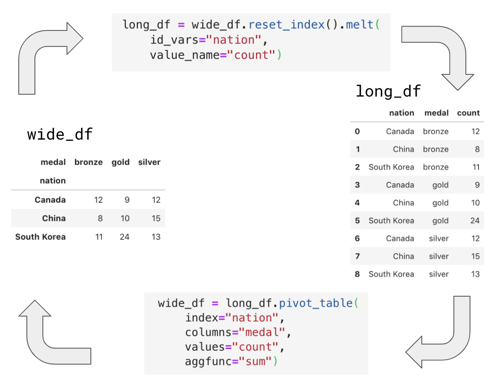
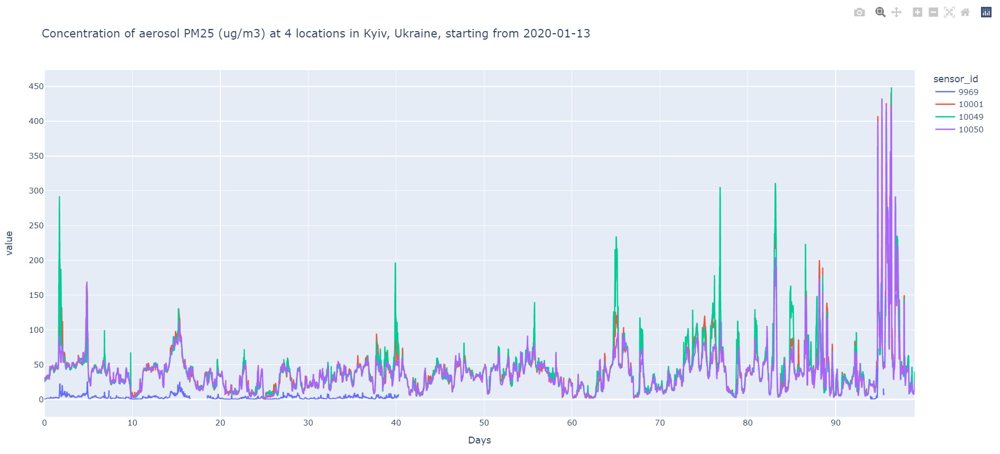

# Довгий чи широкий

*Робота зі складними датафреймами*

В тотальну епоху "великих даних" *Python* створює середовище для дослідницького аналізу даних (explanatory data analysis), яке, у свою чергу, допомагає отримати відповіді на запитання чому і як, дає змогу буквально побачити загальні зв'язки або закономірності, візуалізувати недоречності у даних і багато чого іншого. Але реалізація всіх цих зручностей, перш за все, вимагає налагодження певного технологічного ланцюга обробки даних, рутинною складовою якого є перетворення і, зокрема, переформування даних. 



From [Beyond “tidy”: Plotly Express now accepts wide-form and mixed-form data | by Nicolas Kruchten](https://medium.com/plotly/beyond-tidy-plotly-express-now-accepts-wide-form-and-mixed-form-data-bdc3e054f891)

У цій статті ми випробуємо такі ефективні методи:

- зведення (*pivoting*) даних;
- вибірки даних багатоіндексних і багаторівневих датафреймів.

## Під'єднання даних

Загалом нас цікавить під'єднання різноманітних джерел відкритих даних: бази даних, веб-скрейпінг соціальних мереж та веб-ресурсів тощо. Але наразі ми обмежимось даними моніторингу якості повітря у вигляді окремого CSV-файлу.

Дані були отримані в рамках проєкту [AirZOOM](https://protw.github.io/azreal/#/media/README), виконаного за кошти Громадського Бюджету м. Києва, Україна у 2019-2020 роках. В рамках цих спостережень в середині квітня 2020 спостерігалось значне декількаденне підвищення концентрації аерозолів внаслідок пожеж в чорнобильській зоні відчуження.

Отже, скачуємо дані за майже 4 місяці, отримані з чотирьох датчиків моніторингу якості повітря виробництва компанії [Airly](https://airly.org/):

In [1]:

```python
import pandas as pd
import numpy as np

from config_dir import my_dir # first, set paths to my directories

## Read monitoring data
df = pd.read_csv(my_dir['data'] + r'200421 Chronograf Data.csv')

df
```

Out[2]:

|       |                             time | sensor_id |       val | factor |
| ----: | -------------------------------: | --------: | --------: | -----: |
|     0 | 2020-01-13T00:00 :00.000Z |     10001 | 28.571256 |   PM10 |
|     1 | 2020-01-13T00:00 :00.000Z |     10001 | 26.898551 |   PM25 |
|     2 | 2020-01-13T00:00 :00.000Z |     10049 | 26.591787 |   PM10 |
|   ... |                              ... |       ... |       ... |    ... |
| 38013 | 2020-04-20T23:30 :00.000Z |     10050 | 22.909420 |   PM25 |
| 38014 | 2020-04-20T23:30 :00.000Z |      9969 |       NaN |   PM10 |
| 38015 | 2020-04-20T23:30 :00.000Z |      9969 |       NaN |   PM25 |

Дані у датафреймі `df` представлені 4 стовпчиками:

- `time` - часові відмітки з кроком 30 хвилин;
- `sensor_id` - номери 4 датчиків `[9969, 10001, 10049, 10050]`;
- `val` - значення вимірюваного параметру у мкг/м3;
- `factor` - позначення вимірюваного параметру: `['PM25', 'PM10']` - концентрація пилу (аерозолів) в області 2.5 і 10 мкм, відповідно.

## Форми представлення таблиць даних

Дані представлені у так званій stacked (стопкою) формі. Або інакше іх називають довгою (long) формою.

Тут треба зробити важливий відступ про форму представлення даних. Розрізняють дві форми представлення таблиць даних: довгу (long) або стопкою (stacked) та широку (wide) або unstacked.

Нижче представлений типовий [приклад довгої форми представлення табличних даних](https://plotly.com/python/wide-form/), де кожний рядок представлений записом. Така одновимірна форма типова для реляційних баз даних або журналізації подій.

|      |   nation    | medal  | count |
| :--: | :---------: | :----: | :---: |
|  0   | South Korea |  gold  |  24   |
|  1   |    China    |  gold  |  10   |
|  2   |   Canada    |  gold  |   9   |
|  3   | South Korea | silver |  13   |
|  4   |    China    | silver |  15   |
|  5   |   Canada    | silver |  12   |
|  6   | South Korea | bronze |  11   |
|  7   |    China    | bronze |   8   |
|  8   |   Canada    | bronze |  12   |

Водночас, коли значення деяких стовпчиків мають тип категорій (тобто представлені обмеженою кількістю дискретних значень), то тіж самі дані можна презентувати по іншому - у двовимірній формі, коли деякі параметри утворюють стовпчик з унікальними назвами рядків, а інші параметри утворюють рядок з унікальними назвами стовпчиків. Таке представлення називають широким (*wide*) або *unstacked*. Тут нижче представлені тіж самі дані, переформовані за описаним підходом:

|      |       medal | gold | silver | bronze |
| :--- | ----------: | :--: | :----: | :----: |
|      |  **nation** |      |        |        |
| 0    | South Korea |  24  |   13   |   11   |
| 1    |       China |  10  |   15   |   8    |
| 2    |      Canada |  9   |   12   |   12   |

Форми представлення важливо знати і контролювати під час подання таблиць в якості вхідних даних для пакетів графічного відображення даних. Кожна з форм має свої переваги і обмеження. Так само кожний метод графічної бібліотеки спроможний відображати ту чи іншу форми, але не завжди обидві одночасно.

## Зведення даних (pivoting)

В наших даних `df` стовпчики `sensor_id` і `factor` мають характер категорій, тому їх можна перенести в рядок заголовка з назвою `sensor_id` і `factor`, відповідно. А кожний рядок заповнити їхніми унікальними дискретними значеннями:

|        sensor_id |     9969 |     9969 |    10001 |    10001 |    10049 |    10049 |    10050 |    10050 |
| ---------------: | -------: | -------: | -------: | -------: | -------: | -------: | -------: | -------: |
|       **factor** | **PM10** | **PM25** | **PM10** | **PM25** | **PM10** | **PM25** | **PM10** | **PM25** |
|         **Days** |          |          |          |          |          |          |          |          |
| 2020-01-13T00:00 |    0.925 |    0.840 |    28.57 |    26.89 |    26.59 |    24.60 |    29.51 |    25.92 |
| 2020-01-13T00:30 |    0.515 |    0.508 |    28.18 |    26.58 |    26.78 |    24.97 |    35.61 |    30.61 |
| 2020-01-13T01:00 |    0.365 |    0.347 |    28.51 |    27.00 |    27.33 |    25.33 |    30.80 |    26.90 |
| 2020-01-13T01:30 |    0.733 |    0.696 |    28.79 |    27.45 |    27.77 |    25.71 |    33.12 |    28.35 |

Такого роду операції можна здійснити процедурою зведення (pivoting), що добре відома в Excel і гарно описана, зокрема, [тут](https://pandas.pydata.org/docs/user_guide/reshaping.html). У пакеті *pandas* датафрейми мають відповідний метод `pivot_table` з простим і зрозумілим синтаксисом, яким ми скористаємось для переформування наших даних `df`:

In [3]:

```python
df_re = df.pivot_table(index="time", 
                       columns=["sensor_id","factor"], 
                       values="val") 
df_re
```

Out[4]:

|                sensor_id |     9969 |          |    10001 |          |    10049 |          |    10050 |          |
| -----------------------: | -------: | -------: | -------: | -------: | -------: | -------: | -------: | -------: |
|               **factor** | **PM10** | **PM25** | **PM10** | **PM25** | **PM10** | **PM25** | **PM10** | **PM25** |
|                 **time** |          |          |          |          |          |          |          |          |
| 2020-01-13T00:00:00.000Z |    0.925 |    0.840 |    28.57 |    26.89 |    26.59 |    24.60 |    29.51 |    25.92 |
| 2020-01-13T00:30:00.000Z |    0.515 |    0.508 |    28.18 |    26.58 |    26.78 |    24.97 |    35.61 |    30.61 |
| 2020-01-13T01:00:00.000Z |    0.365 |    0.347 |    28.51 |    26.99 |    27.33 |    25.33 |    30.80 |    26.90 |
|                      ... |      ... |      ... |      ... |      ... |      ... |      ... |      ... |      ... |
| 2020-04-20T22:30:00.000Z |      NaN |      NaN |    12.49 |    12.12 |    13.50 |    12.90 |    11.90 |    11.11 |
| 2020-04-20T23:00:00.000Z |      NaN |      NaN |    16.62 |    16.20 |    20.70 |    19.81 |    12.66 |    11.74 |
| 2020-04-20T23:30:00.000Z |      NaN |      NaN |    34.00 |    30.86 |    46.76 |    39.76 |    24.99 |    22.90 |

## Конвертація часу

Для простоти і зручності конвертуємо стовпчик `time` з формату `datetime` у число днів (неціле) з моменту початку серії вимірювання:

In [5]:

```python
from datetime import datetime

## Convert index from string format to number in days from the 1st data point
def convert_index(df):
    idt = [datetime.strptime(x, '%Y-%m-%dT%H:%M:%S.%fZ') for x in df.index]
    idt = np.array([(x - idt[0]).total_seconds()/3600/24 for x in idt])
    df.set_index(idt,inplace=True)
    df.index.names = ['Days']
    return df

df_re = convert_index(df_re)
```

## Вибірка зі складних таблиць

Через те, що у нашому випадку кількість рядків заголовків більше 1, питання доступу до обраних стовпчиків такої складної таблиці не таке прямолінійне. Тут складною таблицею ми називаємо або багаторівневу таблицю (з декількома рядками заголовків, як у нашому випадку) або багатоіндексну таблицю (з декількома стовпцями індексів) або і те, і те однчасно.

Питання вибірки рядків і стовпців у багаторівневих і багатоіндексних таблицях даних (датафреймах), що зокрема утворюються внаслідок процедури зведення, блискуче висвітлені в [статті](https://towardsdatascience.com/accessing-data-in-a-multiindex-dataframe-in-pandas-569e8767201d).

Скористаємось універсальним методом доступу до даних датафрейму `.loc`.

Наприклад, вибірка за назвою стовпчика верхнього рівня `9969` виглядає як зазвичай, але поверне всі стовпчики нижнього рівня, що включені до неї, а саме `['PM10', 'PM25']`:

In [6]:

```python
sensor_id = 9969
df_re_sel = df_re.loc[:,sensor_id] # returns columns `factor = ['PM10', 'PM25']`
df_re_sel
```

Out[6]:

|    factor |     PM10 |     PM25 |
| --------: | -------: | -------: |
|      Days |          |          |
|  0.000000 | 0.925121 | 0.840580 |
|  0.020833 | 0.515701 | 0.508454 |
|  0.041667 | 0.365942 | 0.347826 |
|       ... |      ... |      ... |
| 98.937500 |      NaN |      NaN |
| 98.958333 |      NaN |      NaN |
| 98.979167 |      NaN |      NaN |

Однак аналогічна спроба вибірки стовпчика нижчого рівня `'PM25'` призведе до помилки:

In [7]:

```python
factor = 'PM25'
try:
    df_re_sel = df_re.loc[:,factor] # *** KeyError: 'PM25'
except KeyError as ke:
    print(f'KeyError {ke} generated')
```

Out [7]:

```
KeyError 'PM25' generated
```

Тим не менш, вибірка гарно спрацює, якщо задати повну кваліфіковану адресу, починаючи з верхнього рівня, через кортеж (tuple):

In [8]:

```python
df_re_sel = df_re.loc[:,(sensor_id,factor)]
df_re_sel
```

Out[8]:

```
Days
0.000000     0.840580
0.020833     0.508454
0.041667     0.347826
               ...   
98.937500         NaN
98.958333         NaN
98.979167         NaN
Name: (9969, PM25), Length: 4752, dtype: float64
```

У такому варіанті запису на будь-якому рівні вже можна задавати декілька стовпчиків, наприклад:

In [9]:

```python
sensor_id, factor = (9969,10001), ('PM25')
df_re_sel = df_re.loc[:,(sensor_id,factor)]
df_re_sel
```

Out[9]:

| sensor_id |     9969 |     10001 |
| --------: | -------: | --------: |
|    factor |     PM25 |      PM25 |
|      Days |          |           |
|  0.000000 | 0.840580 | 26.898551 |
|  0.020833 | 0.508454 | 26.582126 |
|  0.041667 | 0.347826 | 26.999999 |
|       ... |      ... |       ... |
| 98.937500 |      NaN | 12.121981 |
| 98.958333 |      NaN | 16.206522 |
| 98.979167 |      NaN | 30.864735 |

Тепер все ж таки повернімось до вибірки категорій нижче першого рівня. Виявляєтся і це можливо, але іншим методом датафрейму - `.xs`, що називається методом поперечного перерізу (cross-section). Ми вибираємо стовпчики (тобто `axis = 1`) з категорією другого рівня `factor` (тобто `level = 1`):

In [10]:

```python
df_re_sel = df_re.xs(factor,level=1,axis=1)
df_re_sel
```

Out[10]:

| sensor_id |     9969 |     10001 |     10049 |     10050 |
| --------: | -------: | --------: | --------: | --------: |
|      Days |          |           |           |           |
|  0.000000 | 0.840580 | 26.898551 | 24.600241 | 25.921499 |
|  0.020833 | 0.508454 | 26.582126 | 24.977053 | 30.618357 |
|  0.041667 | 0.347826 | 26.999999 | 25.333333 | 26.902174 |
|       ... |      ... |       ... |       ... |       ... |
| 98.937500 |      NaN | 12.121981 | 12.908213 | 11.117150 |
| 98.958333 |      NaN | 16.206522 | 19.818841 | 11.743961 |
| 98.979167 |      NaN | 30.864735 | 39.765702 | 22.909420 |

## Графічне відображення

Для графічного відображення використаємо графічний пакет *plotly*. Цей пакет обрано тут тому що він гарно підійде для майбутньої побудови веб-застосунку спільно з іншим пакетом - *streamlit*.

In [11]:

```python
import plotly.express as px
import plotly.io as pio
pio.renderers.default='svg' # 'browser' or 'svg' or other

## If 'x' is omitted index with its name is taken, 
## otherwise put "x='Days'" into argument list
## If 'y' is omitted all the columns with their names are taken, 
## otherwise put "y=list(df_re_sel.columns)" into argument list
title = f'Aerosol concentration {factor} (ug/m3) ' + \
        f'at {len(df_re_sel.columns)} locations in Kyiv, Ukraine, ' +\
        f'starting from {df.time[0][:10]}'
fig = px.line(df_re_sel,title=title)
fig.show()
```



