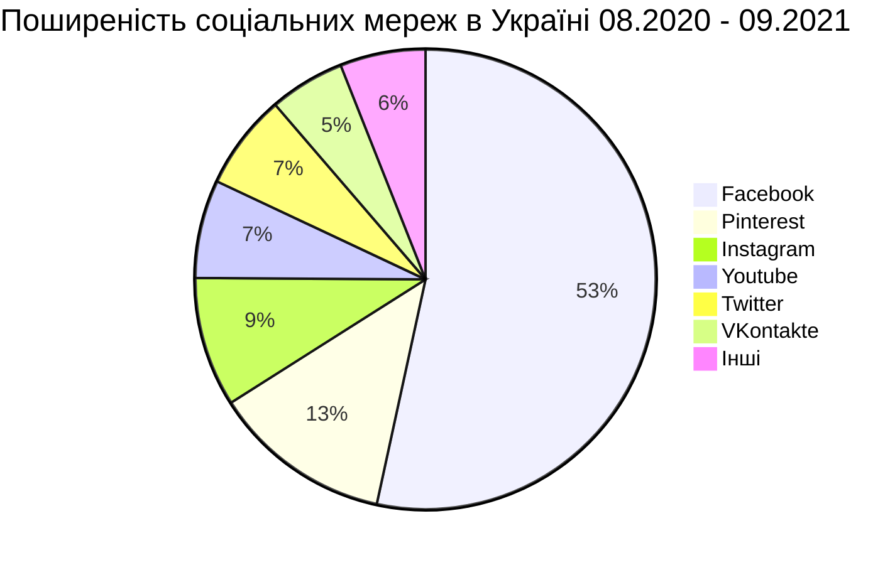

# Соціальні медіа

## Соціальні мережі в Україні

За даними різноманітних статистичних звітів щодо поширеності використання соціальних мереж в Україні на першому місці зі значним відривом перебуває *Facebook*. [Типовий розподіл поширеності](https://gs.statcounter.com/social-media-stats/all/ukraine) соціальних мереж в Україні сер 2020 - вер 2021 представлений нижче:

Для проведення аналізу соціальних медіа серед топових обираємо Твіттер. Попри нижче охоплення в Україні у порівнянні з ФБ та Інстаграм, Твіттер значно менше обмежує користувачів-скреперів.

# Вибір соціальної мережі для досліджень

Проблема, з якою може стикнутися будь-який законослухняний дослідник відкритих публікацій соціальних мереж, це визнання його/її активності в конкретній соцмережі підозрілою завдяки підвищеній частоті або кількості опитувань або порушенню якихось інших, не завжди очевидних, умов використання соцмережі. Наслідком визнання активності обліковки підозрілою може стати блокування (без попередження) обліковки дослідника, з якої дослідження власне і велося. При тому це може відбутися в результаті збирання даних як з допомогою API, так і з допомогою прямого зчитування з веб-сторінки.

Це власне плата за персональну і суспільну безпеку в мережі.

Зокрема обмеження значно посилились за результатами виборчої президентської кампанії 2016 року в США після [скандалу, до якого були причетні компанії Facebook і Cambridge Analytica](https://uk.wikipedia.org/wiki/Витік_даних_Facebook_і_Cambridge_Analytica).

У багатьох публікаціях методів скрейпінгу (scraping) соцмереж відзначаються, що жорсткіші обмеження були запроваджені, у першу чергу, для соцмереж *Facebook* та *Instagram* (що належить *Facebook*).

Із зазначеної вище п'ятірки *Pinterest* і *Youtube* першочергово орієнтовані на фото-, відео- і аудіоконтент. Тому в контексті проєкту *AirScape*, вони тут не розглядаються.

Безпекова політика *Твіттера* кардинально відрізняється *Фейсбука*. Так, зокрема, в статті [Twitter Versus Facebook: Why Selling Access Is Better Than Selling Data](https://www.forbes.com/sites/kalevleetaru/2019/04/13/twitter-versus-facebook-why-selling-access-is-better-than-selling-data/) зазначається:

>  *Facebook* та *Twitter* представляють протилежні крайності революції соціальних медіа.
>
>  Facebook зосередився на тому, щоб з'єднати друзів, сусідів та родину разом за допомогою спілкування та обміну інформацією, що контролюється конфіденційністю. Його платформа була розроблена для з'єднання окремих людей та невеликих груп. Дохід надходить за рахунок реклами. Дані можна збирати масово таким чином, щоб посилити центральність Facebook у глобальній комунікаційній мережі.
>
>  На противагу цьому, Twitter зосередився на тому, щоб бути трансляційною платформою, подібною до новин у реальному часі, а публікації за замовчуванням читаються у всьому світі. Його платформа була розроблена для з'єднання людей з самою планетою. Дохід був отриманий як від реклами, так і від продажу пакетних потоків загальної кількості всіх публічних повідомлень у режимі реального часу компаніям по всьому світу. Дані можна було масово купувати або завантажувати безкоштовно до 1% потоку

?> З огляду на наведені вище міркування, в цьому проєкті - *AirScape* ми обираємо соцмережу *Твіттер* за основу для збирання і аналізу даних з метою оцінки якості повітря.