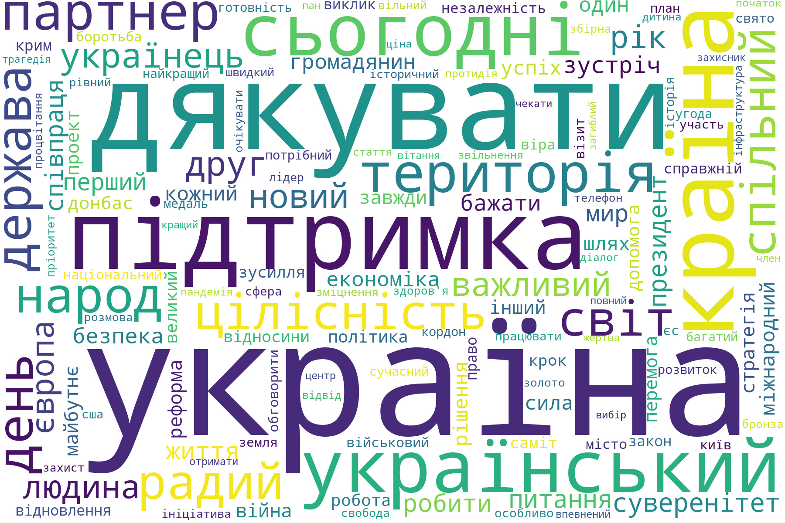

# Україна, дякувати, підтримка - про що думає Президент України

Найважливіше, що сказав Президент України у своєму Твіттері за два роки - аналіз текстів з допомогою побудови "*хмари слів*" -- The most important things that the President of Ukraine said on his Twitter account in two years - analysis of texts by constructing a "*word cloud*".

О 14:46 25 квітня 2019 року новообраний Президент України п. В. Зеленський [сповістив світові](https://twitter.com/ZelenskyyUa/status/1121379865289285632) про свій вихід на простори Твіттера під ніком `@ZelenskyyUa`:

> *Привіт, Україно! Привіт, Світ! Це — мій офіційний твіттер. Hello Ukraine! Hello World! This is my official Twitter-account.*

З того часу і до 14 жовтня 2021 року п. Зеленським оприлюднено 1368 твітів. З них:

| Мова твіту                                                   | Кількість твітів |
| :----------------------------------------------------------- | :--------------: |
| українською                                                  |       833        |
| англійською                                                  |       506        |
| російською                                                   |        2         |
| іншими мовами: грецькою, французькою, італійською, івріт, японською, польською, португальською, турецькою, китайською |        23        |
| двомовні або мова не визначена                               |        4         |

## Що і як

Для аналізу оприлюднених текстів ми використовуватиме тут підходи NLP, що реалізовані на Python.

Матеріал цієї статті надихнутий двома авторами:

- [Перші кроки в NLP: розглядаємо Python-бібліотеку NLTK в реальному завданні | DOU](https://dou.ua/lenta/articles/first-steps-in-nlp-nltk/)
- [Python Word Cloud and NLTK | Shep Sheppard](https://sqlshep.com/?p=971)

Зчитування твітів тут не описано і здійснено попередньо з допомогою бібліотеки *twint*. Приклад застосування *twint* [тут](https://protw.github.io/airscape/#/twint_read).

## Зчитуємо стоп-слова

Список з 1983 українських стоп-слів запозичено у [skupriienko](https://github.com/skupriienko/Ukrainian-Stopwords/blob/master/stopwords_ua.txt).

```python
#### Reading Ukrainian stopwords

import pandas as pd

stopwords_ua_file = 'stopwords_ua.txt'
stopwords_ua_df = pd.read_csv(stopwords_ua_file, index_col=False, header=None)
stopwords_ua = list(stopwords_ua_df.iloc[:,0])
```

## Збираємо текст

Всі твіти з обліковки *@ZelenskyyUa* зчитані з допомогою демо модулю [twint_ops](https://github.com/protw/airscape/blob/master/src/twint_ops.py). Ім'я файлу сформовано функцією *twint_query_pars()* в елементі словника *'output_name'*. Далі ми вибираємо твіти складені українською мовою. Останнім кроком об'єднуємо текст усіх твітів в єдиний текстовий рядок *text_ua*.

```python
#### The tweets were already read

from twint_ops import twint_query_pars, twint_read_csv

tw = twint_query_pars()
twint_df = twint_read_csv(tw['output_name'])
tweets_ua = twint_df.loc[twint_df['language']=='uk','tweet']
text_ua = ' '.join(tweets_ua)
```

## Українська токенізація і стематизація

Наступний крок це українська токенізація і стематизація зведеного тексту *text_ua* з використанням функції *ua_tokenizer* з власного модулю *nlp_akhmel*, що написаний за мотивами вищезгаданої статті Андрія Хмельницького.

```python
from nlp_akhmel import ua_tokenizer

tokenized_list = ua_tokenizer(text_ua, ua_stemmer=True, stop_words=stopwords_ua)
```

## Скоригована версія частотного розподілу термінів

Насправді, для побудови хмари слів краще підходить лематизований словник тексту. Відверто кажучи стематизатор, що ми тут використовуємо, мене не повністю задовольняє - деякі терміни, представлені окремо, насправді мають спільну лему. Опанування лематизації - це питання подальших кроків. Тому, поки що обмежимось стематизацією.

А тим часом, побудуємо частотний спектр словника і зведемо вручну деякі розведені терміни, приплюсовуючи їхні вагові коєфіцієнти.

```python
wordcloud = WordCloud(width=1800,height=1200, background_color='white'). \
    generate_from_frequencies(word_freq)

#### First we create the word frequency dictionary 'word_freq'

word_freq = worldcloud.words_

#### Then we manually correct the word frequency dictionary 'word_freq' 
#### and prepare corrected version of 'word_freq' in 'word_freq_zel_2.py'
```

В результаті збережемо скориговану версію частотного розподілу термінів *word_freq* у модулі *word_freq_zel_2.py*.

## Побудова хмари слів

Будуємо хмару слів у декілька коротких кроків:

- завантажуємо скориговану версію частотного розподілу термінів *word_freq* у модулі *word_freq_zel_2.py*.
- будуємо хмару слів з частотного розподілу
- одночасно зберігаємо побудоване зображення у файл *'word_freq_zel.png'*
- виводимо зображення тут у коді.

```python
#### We build world cloud 'wrdcld' and simultaneously save it to image
#### 'word_freq_zel.png'

from word_freq_zel_2 import word_freq
from wordcloud import WordCloud

wrdcld = WordCloud(width=1800, height=1200, background_color='white').\
    generate_from_frequencies(word_freq).to_file('word_freq_zel.png')

#### Finally we plot the word cloud

import matplotlib.pyplot as plt

width = 12
height = 8
plt.figure(figsize=(width, height))
plt.imshow(wrdcld)
plt.axis("off")
plt.show()
```



Вуаля! Далі робота для соціологів, політологів, політиків. Для поглибленого аналізу можна скористатись [готовою таблицею частотного розподілу термінів](https://github.com/protw/airscape/blob/master/src/word_freq_zel.csv).

