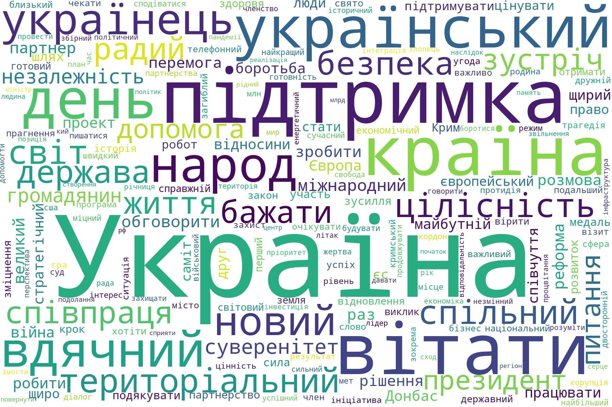

# Україна, підтримка, вітати - про що думає Президент

Найважливіше, що сказав Президент України у своєму Твіттері за два роки - аналіз текстів з допомогою побудови "*хмари слів*" -- The most important things that the President of Ukraine said on his Twitter account in two years - analysis of texts by constructing a "*word cloud*".

О 14:46 25 квітня 2019 року новообраний Президент України п. В. Зеленський [повідомив світ](https://twitter.com/ZelenskyyUa/status/1121379865289285632) про вихід на простори Твіттера під ніком `@ZelenskyyUa`:

> *Привіт, Україно! Привіт, Світ! Це — мій офіційний твіттер. Hello Ukraine! Hello World! This is my official Twitter-account.*

З того часу і до 14 жовтня 2021 року п. Зеленським оприлюднено 1368 твітів. З них:

| Мова твіту                                                   | Кількість твітів |
| :----------------------------------------------------------- | ---------------: |
| українською                                                  |              833 |
| англійською                                                  |              506 |
| російською                                                   |                2 |
| іншими мовами: грецькою, французькою, італійською, івріт, японською, польською, португальською, турецькою, китайською |               23 |
| двомовні або мова не визначена                               |                4 |

## Що і як

Ми використовуватиме тут підходи NLP, що реалізовані на Python.

Матеріал цієї статті надихнутий трьома авторами і простим пакетом лематизації:

- [Перші кроки в NLP: розглядаємо Python-бібліотеку NLTK в реальному завданні | DOU](https://dou.ua/lenta/articles/first-steps-in-nlp-nltk/)
- [Python Word Cloud and NLTK | Shep Sheppard](https://sqlshep.com/?p=971)
- [A simple multilingual lemmatizer for Python - Bits of Language: corpus linguistics, NLP and text analytics](https://adrien.barbaresi.eu/blog/simple-multilingual-lemmatizer-python.html)
- [Counting Word Frequencies with Python | Programming Historian](https://programminghistorian.org/en/lessons/counting-frequencies)

Зчитування твітів тут не описано і здійснено попередньо з допомогою бібліотеки *twint*. Приклад застосування *twint* [тут](https://protw.github.io/airscape/#/twint_read).

## Зчитуємо стоп-слова

Список з 1983 українських стоп-слів запозичено у [skupriienko](https://github.com/skupriienko/Ukrainian-Stopwords/blob/master/stopwords_ua.txt).

Після декількох експериментів з реальними текстами виявилась значна частота похідних від терміна `мати` (`to have`). Через що прийшлося вручну внести похідні цього слова до списку українських стоп-слів *'stopwords_ua.txt'*:

> *мав, має, маємо, маєте, мала, мали, мати, матиме, матимемо, матиму, матимеш, маю, мають*

Це не досконале рішення через подвійність значення слів *мала* і *мати*, але вирішення цього питання відкладемо на майбутнє.

```python
""" Reading Ukrainian stopwords
"""
import pandas as pd

stopwords_ua_file = 'stopwords_ua.txt'
stopwords_ua_df = pd.read_csv(stopwords_ua_file, index_col=False, header=None)
stopwords_ua = list(stopwords_ua_df.iloc[:,0])
```

## Збираємо текст

Всі твіти з обліковки *@ZelenskyyUa* попередньо зчитані з допомогою демо модулю [twint_ops](https://github.com/protw/airscape/blob/master/src/twint_ops.py). Ім'я файлу сформовано функцією *twint_query_pars()* в елементі словника *'output_name'*. Далі ми лише вибираємо твіти складені українською мовою. Останнім кроком об'єднуємо текст усіх твітів в єдиний текстовий рядок *text_ua*.

```python
""" We already read tweets
"""
from twint_ops import twint_query_pars, twint_read_csv

tw = twint_query_pars()
twint_df = twint_read_csv(tw['output_name'])
tweets_ua = twint_df.loc[twint_df['language']=='uk','tweet']
text_ua = ' '.join(tweets_ua)
```

## Українська токенізація і лематизація

Наступний крок це українська токенізація і стематизація зведеного тексту *text_ua* з використанням функції *ua_tokenizer* з власного модулю [*nlp_akhmel*](https://github.com/protw/airscape/blob/master/src/nlp_akhmel.py), що написаний за мотивами вищезгаданої статті Андрія Хмельницького. Останнім кроком проводимо лематизацію з допомогою модулю *simplemma*, що підтримую українську 190 тис. словами. Це не так потужно, як хотілось би, але для випробувань достатньо.

```python
""" Tokenizing and lemmatizing word list
"""
from nlp_akhmel import ua_tokenizer
import simplemma
langdata = simplemma.load_data('uk')

tokenized_list = ua_tokenizer(text_ua,ua_stemmer=False,stop_words=stopwords_ua)
lemmatized_list = [simplemma.lemmatize(t, langdata) for t in tokenized_list]
```

## Частотний розподіл слів

Хоча модуль *WordCloud* може сам будувати частотний розподіл слів, але його результати дещо не зрозумілі. Так у побудованому ним частосному розподілі трапляються біграми (пара слів). Як це налаштовується в документації знайти не вдалося, а у код немає бажання лізти.

Гарною новиною є те, що *WordCloud* має метод побудови графічного розподілу слів із частотного розподілу, який має формат словника, в якому `key` - це власне слово-термін і `value` - кількість входжень терміну у текст.

Для побудови частотного розподілу скористаємось елегантним кодом функції *wordListToFreqDict* з [Counting Word Frequencies with Python | Programming Historian](https://programminghistorian.org/en/lessons/counting-frequencies).

```python
""" Building the frequency dictionary from word list
"""
def wordListToFreqDict(word_list):
    word_freq = [word_list.count(word) for word in word_list]
    return dict(list(zip(word_list,word_freq)))

word_freq = wordListToFreqDict(lemmatized_list)
```

## Сортування і збереження словника

Сортування словника *word_freq* за значенням у порядку спадання відбувається з допомогою функції *sortFreqDict*, а збереження словника у CSV-файлі з допомогою функції *dict2csv*. Остання функція додатково перед збереженням здійснює перекодування тексту з `UTF-8` на `UTF-8 BOM` для коректного відтворення тексту в Excel. Ці дві функції розташовані в модулі [*utils*](https://github.com/protw/airscape/blob/master/src/utils.py).

```python
from utils import sortFreqDict, dict2csv

word_freq = sortFreqDict(word_freq)
csv_file = 'word_freq_zel.csv'
dict2csv(word_freq, csv_file)
```

## Побудова хмари слів

Будуємо хмару слів у один рядок:

- використовуємо частотного розподіл термінів *word_freq*;
- будуємо хмару слів з частотного розподілу з використанням методу *generate_from_frequencies*;
- одночасно зберігаємо побудоване зображення у файл *'word_freq_zel.png'* з допомогою метода *to_file*.

```python
""" We build world cloud 'wrdcld' and simultaneously save it to image
"""
from wordcloud import WordCloud

wrdcld = WordCloud(width=1800, height=1200, background_color='white').\
    generate_from_frequencies(word_freq).to_file('word_freq_zel.png')
word_freq1 = wrdcld.words_
```

- виводимо зображення на екран тут же у коді.

```python
""" Finally we plot the word cloud
"""
import matplotlib.pyplot as plt

width = 12
height = 8
plt.figure(figsize=(width, height))
plt.imshow(wrdcld)
plt.axis("off")
plt.show()
```



Вуаля! Далі робота для соціологів, лінгвістів, політологів, політиків. Для поглибленого аналізу можна скористатись [готовою таблицею частотного розподілу термінів](https://github.com/protw/airscape/blob/master/src/word_freq_zel.csv).
