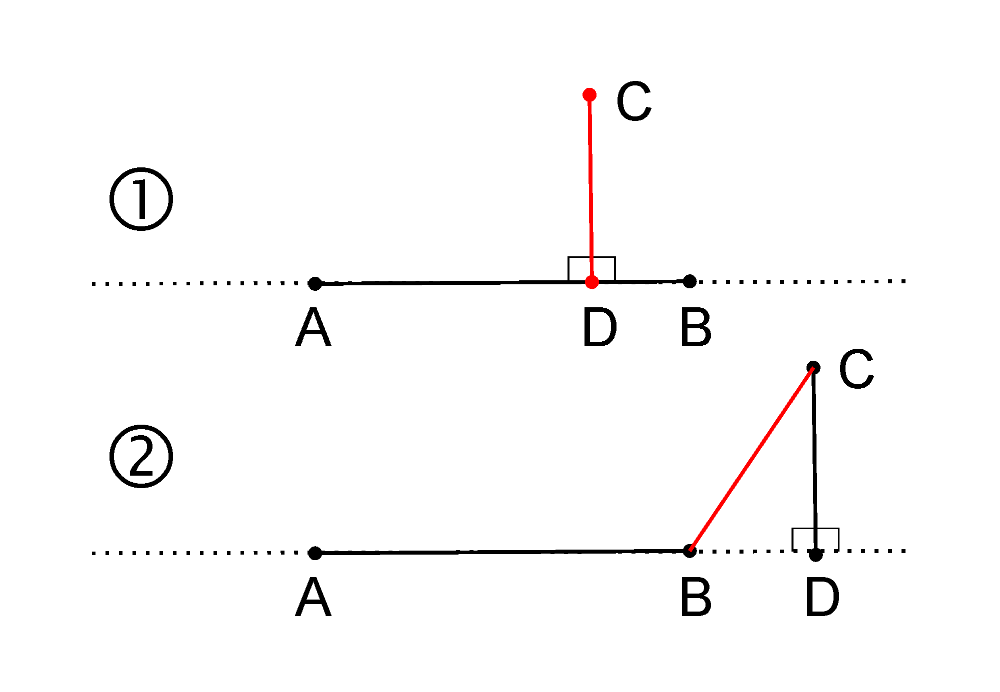
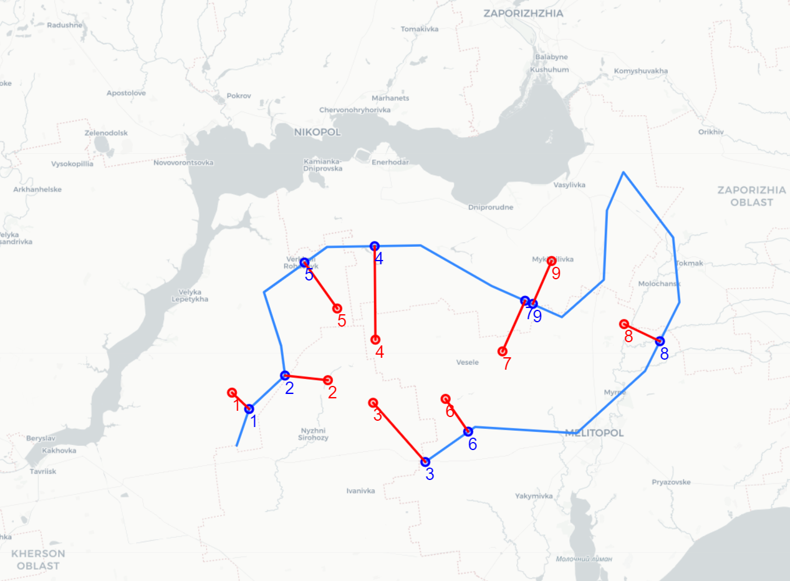

# Найменша відстань від точки до полігону на поверхні геоїду

## Постановка задачі

Доволі поширеною географічною задачею є знаходження найменшої відстані від референтної точки до якоїсь межевої лінії, або найближчої точки з межевої лінії до референтної точки. Ви самостійно можете знайти безліч конкретних ситуацій, де вимагається вирішення цієї задачі.

Пошук в інтернеті рішення задачі вивів на статтю Maximilian Hofmann [Calculating distances from Points to Polygon Borders in Python](https://medium.com/analytics-vidhya/calculating-distances-from-points-to-polygon-borders-in-python-a-paris-example-3b597e1ea291). Мені сподобались структура і викладення рішення, але я не погоджуюсь з методом, що автор поклав в основу свого рішення, а саме: пошук відстані між референтною точкою і серединою кожного відрізку полігону. Відштовхуючись від підходу Максиміліана, я використав більш придатний метод для вирішення поставленої задачі.

## Пояснення метода

Тепер повернімося до нашої задачі. 

### Мінімальна відстань між точкою і відрізком на площині 

Суть знаходження мінімальної відстані між точкою і відрізком прямої на площині можна пояснити, навіть не використовуючи малюнок. Для цього треба уявити перпендикуляр `CD`, проведений з референтної точки `C` до лінії, що є продовженням відрізку `AB`. 



В результаті можуть виникнути лише 2 випадки:

1. точка `D` перетину перпендикуляру і лінії **<u>належить</u>** відрізку `AB` – у цьому разі мінімальна відстань між точкою `C` і відрізком `AB` дорівнює `CD`;
2. точка `D` перетину перпендикуляру і лінії **<u>не належить</u>** відрізку `AB` – у цьому разі мінімальна відстань між точкою `C` і відрізком `AB` дорівнює `CB` (або `CA`, в залежності від того, з якої сторони від відрізку розташована точка `D`);

### Полігон на площині

Полігон представляє собою зв'язані між собою відрізки прямої. Тому задача знаходження мінімальної відстані між референтною точкою і полігоном розділяється на окремі однакові задачі пошуку мінімальної відстані між референтною точкою і кожним відрізком прямої зі складу полігону. Після знаходження для кожного відрізку полігону такої мінімальної відстані, ми вибираємо мінімальне значення з множини цих відстаней.

### Сферичний трикутник

На практиці вирішення геодезничних задач дещо складніше: точка і полігон розташовані не на площині, а на поверхні геоїда (Землі), що доволі точно описується сферою. Тоді замість плаского трикутника `ABC` ми маємо розглядати сферичний трикутник. Ми вже колись розбирались з таким трикутником, зокрема у статті [Математика сферичного трикутника](https://protw.github.io/treemap/#Математика%20сферичного%20трикутника). У такому трикутнику сторони представлені дугами великого кола сфери замість прямих відрізків. А решта співвідношень сферичного трикутника дуже схожі на співвідношення плаского трикутника з тією різницею, що міра довжини першого вимірюється у кутових одиницях (градусах чи радіанах), а не, скажімо, в метрах. Вже потім результат, отриманий в градусах, можна перевести в метри, знаючи радіус сфери.

## Усунення проблеми зі Spyder

Зазвичай вирішення будь-якої задачі вимагає попереднього налагодження середовища. Даний випадок не став виключенням через проблему неналежної роботи дебагера *Spyder* 5.1.5 з *Python* 3.9.6 . Для усунення цих неполадок прийшлося встановити віртуальний простір в *Python* з конкретними версіями компонент, а саме, понизивши версію *Python* з 3.9.6 до 3.8.10:

```
> conda create -n gis -c conda-forge python=3.8.10 spyder=5.1.5 folium geojson
> activate gis
> pip install PyGeodesy
```

## Підготовка даних

Тепер ми готові до практичного вирішення задачі.

Як завжди почнімо із підключення потрібних нам для вирішення модулів:

```python
from pygeodesy import sphericalTrigonometry as st
import geojson
import folium
from folium.features import DivIcon
```

Тестові дані для побудови полігону і декількох референтних точок були створені з допомогою Google Earth і скачані у вигляді kml-файлів. Для зручності я конвертував дані з kml у json формат з допомогою одного з онлайн-конверторів, безліч яких можна знайти в інтернеті. Завантаження вже конвертованих тестових даних у json форматі для вирішення виглядає наступним чином:

```python
## Read data
polygon_file = 'data/open-polygon.geojson'
points_file = 'data/points.geojson'

with open(polygon_file) as f:
    data_poly = geojson.loads(f.read())
with open(points_file) as f:
    data_pnts = geojson.loads(f.read())
```

Різні методи, особливо для цілей геодезії, використовують багато форматів для представлення тих самих даних. В нашому випадку ми використовуватимемо для представлення наших простих геоданих два формати: 

1) список списків  координат окремих точок `[Lat, Lon]` і 
2) список тих самих координат типу *LatLon*, що необхідно для роботи з методами з бібліотеки *pygeodesy*. 

Для цього проведемо ще одну конвертацію даних:

```python
## Transforming data for 'nearestOn3' method
def transform_data(data):
    # swap order of coords from [Long,Lat] to [Lat,Long]
    pnts = [[p[1],p[0]] for p in data.features[0].geometry.coordinates]
    # prepare data type appropriate for 'nearestOn3' method
    pnts_LL = [st.LatLon(p[0],p[1]) for p in pnts]
    return pnts, pnts_LL

pnts, pnts_LL = transform_data(data_pnts)
poly, poly_LL = transform_data(data_poly)
```

> :warning: Під час цих конвертацій дуже важливо контролювати правильний порядок координат `(Lat, Lon)` або `(Lon, Lat)` - у різних застосунках і методах цей порядок може бути різним!

В підсумку я створив з допомогою Google Earth довільні тестові вхідні дані, що мають такі значення:

### Полігон

|  #   | Latitude  | Longitude |  #   | Latitude | Longitude |
| :--: | --------- | --------- | :--: | -------- | --------- |
|  1   | 46.81722  | 34.10702  |  10  | 47.21659 | 35.4001   |
|  2   | 46.904731 | 34.15035  |  11  | 47.3814  | 35.41083  |
|  3   | 46.986498 | 34.27795  |  12  | 47.47345 | 35.46811  |
|  4   | 47.05636  | 34.26313  |  13  | 47.3171  | 35.6442   |
|  5   | 47.186362 | 34.20247  |  14  | 47.16143 | 35.66639  |
|  6   | 47.294371 | 34.42552  |  15  | 46.99791 | 35.54737  |
|  7   | 47.297157 | 34.75507  |  16  | 46.8479  | 35.30453  |
|  8   | 47.201114 | 35.00568  |  17  | 46.86158 | 34.94691  |
|  9   | 47.127055 | 35.25338  |  18  | 46.77776 | 34.77163  |

### Координати референтних точок

|  #   | Ref Latitude | Ref Longitude |
| :--: | ------------ | ------------- |
|  1   | 46.944694    | 34.09001      |
|  2   | 46.974938    | 34.42855      |
|  3   | 46.920729    | 34.58714      |
|  4   | 47.071689    | 34.59715      |
|  5   | 47.146083    | 34.46176      |
|  6   | 46.929174    | 34.84293      |
|  7   | 47.04336     | 35.04331      |
|  8   | 47.110322    | 35.47141      |
|  9   | 47.259687    | 35.21716      |

## Опис і виклик метода

Для знаходження найближчих точок і одночасно найкоротшої відстані між референтною точкою і полігоном використаємо метод [nearestOn3](https://mrjean1.github.io/PyGeodesy/docs/pygeodesy.sphericalTrigonometry-module.html#nearestOn3) з пакету *PyGeodesy* . У якості обов'язкових вхідних аргументів метод приймає координати  референтної точки `pnt_LL` і список координат полігону `poly_LL`. Всі координати передаються під типом `LatLon`, що визначений у пакеті *PyGeodesy* .

З огляду на те, що ми визначили декілька референтних точок через список `pnts_LL`, обрахуємо одразу список найближчих точок `nearest_pnts` до цих референтних точок: 

```python
nearest_pnts = [st.nearestOn3(pnt_LL, poly_LL) for pnt_LL in pnts_LL]
```

Кожний елемент списку `nearest_pnts` представляє собою кортеж (tuple) з трьох елементів `(closest, distance, angle)`, де:

- `closest` – координати найближчої точки на полігоні `poly_LL` під типом `LatLon` або `LatLon3Tuple(lat, lon, height)`;
- `distance` – відстань між найближчою точкою `closest` на полігоні `poly_LL` і референтною точкою `pnt_LL`, що конвертована в ті самі одиниці вимірювання, що й вхідний аргумент `radius`, який за замовчанням визначений у метрах `radius = 6371008.77141`;
- `angle` – кут променю від референтної точки `pnt_LL` до точки `closest` у градусах компасу.

Для інших цілей, зокрема, розрахунків і графічного відображення нам може знадобитись список найближчих точок `nearest_pnts` у простішому форматі `n_pnts`, як-от список списків координат окремих точок `[Lat, Lon]`, для чого ми проведемо просте перетворення:

```python
n_pnts = [[np[0].lat,np[0].lon] for np in nearest_pnts] 
```

## Відображення результату на мапі

Завдячуючи статті Maximilian Hofmann я зекономив багато зусиль на освоєнні відображення результатів і дещо переробив код Максиміліана.

Представлений нижче фрагмент коду відображення результатів є значною мірою самозрозумілим і складається з декількох наступних кроків:

1. визначення центральної точки `poi` вікна відображення мапи;
2. відображення полігону `data_poly` на мапі;
3. відображення референтних точок `pnts` і відповідних найближчих точок `n_pnts` на мапі;
4. відображення відрізків, що поєднують відповідні референтні точки `pnts` і найближчі точки `n_pnts`, на мапі;
5. збереження результату у форматі HTML на диску.

```python
#### DISPLAY RESULT

## Select central point for displaying the map
poi = data_pnts.features[0].geometry.coordinates[4]
poi = [poi[1], poi[0]] # in folium.Map the order is - Lat, Long

## Display polygon on the map
m = folium.Map(location=poi, zoom_start=9, tiles='openstreetmap')
folium.GeoJson(data_poly).add_to(m) # here the order is - Long, Lat

## Display reference points 'pnts' and nearest points 'n_pnts'
def show_pnts_on_map(points,map,color='red'):
    fstr = '<div style="font-size: 16pt; color: ' + color + '">{}</div>'
    for i,_ in enumerate(points):
        folium.CircleMarker(location=points[i], color=color, radius=5, 
                            fill=color).add_to(map)
        folium.map.Marker(location=points[i], 
                          icon=DivIcon(icon_size=(150, 36),icon_anchor=(0, 0),
                                       html=fstr.format(str(i+1))
        )).add_to(map)
    return map

m = show_pnts_on_map(pnts,m,'red')
m = show_pnts_on_map(n_pnts,m,'blue')

## Display line segments connecting reference points and corresponding nearest points
for i,_ in enumerate(pnts):
    folium.PolyLine(locations=[pnts[i],n_pnts[i]], color='red').add_to(m)
    print(pnts[i][0], pnts[i][1], n_pnts[i][0], n_pnts[i][1],
          nearest_pnts[i][1],nearest_pnts[i][2])

## Store the map on the disk
m.save('map_my_1.html')
```

Переглянути результат можна просто клацнувши файл `map_my_1.html` у файловому провідникові.

Результат виглядатиме на карті таким чином:



У табличному вигляді результуючи дані виглядатимуть таким чином:

|  #   | Ref Latitude | Ref Longitude | Nearest Latitude | Nearest Longitude | Distance, m | Angle, degree |
| :--: | ------------ | ------------- | ---------------- | ----------------- | ----------- | ------------- |
|  1   | 46.944694    | 34.09001      | 46.90473         | 34.15035          | 6383.2      | 134.1         |
|  2   | 46.974938    | 34.42855      | 46.9865          | 34.27795          | 11496.9     | 276.4         |
|  3   | 46.920729    | 34.58714      | 46.77776         | 34.77163          | 21203.0     | 138.6         |
|  4   | 47.071689    | 34.59715      | 47.29579         | 34.59339          | 24920.6     | 359.3         |
|  5   | 47.146083    | 34.46176      | 47.25612         | 34.34653          | 15016.7     | 324.6         |
|  6   | 46.929174    | 34.84293      | 46.8504          | 34.92352          | 10688.1     | 145.0         |
|  7   | 47.04336     | 35.04331      | 47.16611         | 35.12274          | 14914.9     | 23.8          |
|  8   | 47.110322    | 35.47141      | 47.06763         | 35.59812          | 10703.3     | 116.3         |
|  9   | 47.259687    | 35.21716      | 47.15769         | 35.15093          | 12396.5     | 203.8         |

## Посилання 

1. [Calculating distances from Points to Polygon Borders in Python — A Paris Example | by Maximilian Hofmann | Analytics Vidhya | Mar 19, 2020, Medium](https://medium.com/analytics-vidhya/calculating-distances-from-points-to-polygon-borders-in-python-a-paris-example-3b597e1ea291)
2. [PyGeodesy – бібліотека геодезичних інструментів на Python](https://mrjean1.github.io/PyGeodesy/docs/pygeodesy-module.html)
3. [Математика сферичного трикутника | Олег Бондаренко | 11 червня 2020,  protw.io](https://protw.github.io/treemap/#Математика%20сферичного%20трикутника)
4. [Код знаходження найменшої відстані від точки до полігону на поверхні геоїду](https://github.com/protw/airscape/blob/master/stavok/gis/medium_polygon_distance/p2poly.py)

