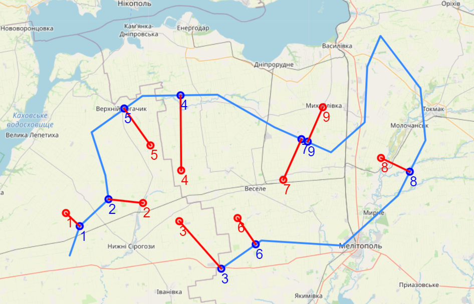

# Найменша відстань від точки до полігону на поверхні геоїду

Код: [p2poly2.py](p2poly2.py)

В основі рішення використаний метод `nearestOn3` з [бібліотеки `PyGeodesy`](https://mrjean1.github.io/PyGeodesy/docs/pygeodesy.sphericalTrigonometry-module.html#nearestOn3)

Натхненником рішення виступила стаття Maximilian Hofmann "[Calculating distances from Points to Polygon Borders in Python — A Paris Example](https://medium.com/analytics-vidhya/calculating-distances-from-points-to-polygon-borders-in-python-a-paris-example-3b597e1ea291)".

## Полігон

|  #   | Lat       | Long     |  #   | Lat      | Long     |
| :--: | --------- | -------- | :--: | -------- | -------- |
|  1   | 46.81722  | 34.10702 |  10  | 47.21659 | 35.4001  |
|  2   | 46.904731 | 34.15035 |  11  | 47.3814  | 35.41083 |
|  3   | 46.986498 | 34.27795 |  12  | 47.47345 | 35.46811 |
|  4   | 47.05636  | 34.26313 |  13  | 47.3171  | 35.6442  |
|  5   | 47.186362 | 34.20247 |  14  | 47.16143 | 35.66639 |
|  6   | 47.294371 | 34.42552 |  15  | 46.99791 | 35.54737 |
|  7   | 47.297157 | 34.75507 |  16  | 46.8479  | 35.30453 |
|  8   | 47.201114 | 35.00568 |  17  | 46.86158 | 34.94691 |
|  9   | 47.127055 | 35.25338 |  18  | 46.77776 | 34.77163 |

## Координати референтних і найближчих точок на полігоні

|  #   | Ref Lat   | Ref Long | Nearest Lat | Nearest Long | Dist, m | Angle, deg |
| :--: | --------- | -------- | ----------- | ------------ | ------- | ---------- |
|  1   | 46.944694 | 34.09001 | 46.90473    | 34.15035     | 6383.2  | 134.1      |
|  2   | 46.974938 | 34.42855 | 46.9865     | 34.27795     | 11496.9 | 276.4      |
|  3   | 46.920729 | 34.58714 | 46.77776    | 34.77163     | 21203.0 | 138.6      |
|  4   | 47.071689 | 34.59715 | 47.29579    | 34.59339     | 24920.6 | 359.3      |
|  5   | 47.146083 | 34.46176 | 47.25612    | 34.34653     | 15016.7 | 324.6      |
|  6   | 46.929174 | 34.84293 | 46.8504     | 34.92352     | 10688.1 | 145.0      |
|  7   | 47.04336  | 35.04331 | 47.16611    | 35.12274     | 14914.9 | 23.8       |
|  8   | 47.110322 | 35.47141 | 47.06763    | 35.59812     | 10703.3 | 116.3      |
|  9   | 47.259687 | 35.21716 | 47.15769    | 35.15093     | 12396.5 | 203.8      |

## Зображення: полігон, координати референтних і найближчих точок на полігоні

