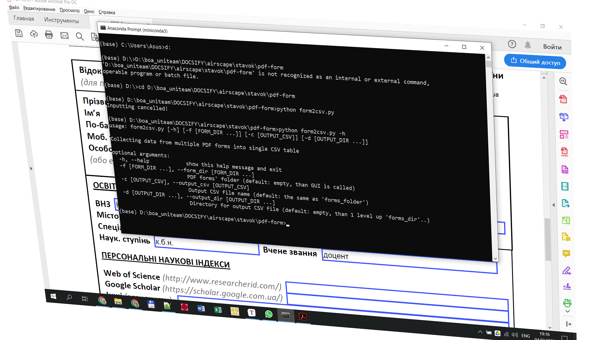

# Simple CLI + GUI for processing PDF forms

If you are tired of immersing in the code every time to adjust the input parameters, then this material is for you.



User interaction with software products, even with your own, is an important prerequisite for their effective reuse for both the author and other users. Both the command line interface (CLI) and the graphical user interface (GUI) are important for this interaction.

In a recent article, ["Automated processing of PDF forms"](https://oleghbond.medium.com/automated-processing-of-pdf-forms-fa635d497fc1#42a6), I described the implementation of a utility for automated processing of PDF forms. Everything seems to work fine, but this application clearly lacked a simple user interface. So I decided to fill in this gap.

## What we want to build

To run the utility (let's call it here `parse_cmd_line.py`) we need a fairly simple interface with four input parameters:

| Parameter sintax                             | Explanation                                                  |
| -------------------------------------------- | ------------------------------------------------------------ |
| `-h, --help`                                 | Help                                                         |
| `-f [FORM_DIR], --form_dir [FORM_DIR]`       | folder where the same type of PDF forms are placed           |
| `-c [OUTPUT_CSV], --output_csv [OUTPUT_CSV]` | the name of the CSV table file where the values of the fields of the completed forms are collected |
| `-d [OUTPUT_DIR], --output_dir [OUTPUT_DIR]` | folder where the resulting CSV table will be placed          |

Square brackets indicate an optional parameter. There are two forms of writing a parameter, which are identical in action: *short* - with a single hyphen in front and *long* - with a double hyphen in front. The values of the parameters, transmitted to the input of the utility, are indicated in capital letters.

A meta-code of the command line to run the utility looks like this:

```shell
> python parse_cmd_line.py [-h] [-f [FORM_DIR]] [-c [OUTPUT_CSV]] [-d [OUTPUT_DIR]]
```

At the same time, we want to determine which interface we will use - CLI or GUI. It is also advisable not to inflate the number of parameters so that they are easy to remember, as well as to have a short help at hand to control comfortably the launch of the utility.

## Command line analysis logic

The logic of command line analysis is presented in the table below. Columns 2, 3 and 4 describe how the values of the input parameters are formed in cases when:

- parameter and values are omitted;
- parameter is present, value is omitted;
- both parameter and value are present.

| Parameter          | Parameter and values<br /> are omitted                       | Parameter is present, <br />value is omitted                 | Parameter <br />and value <br />are present |
| ------------------ | ------------------------------------------------------------ | ------------------------------------------------------------ | ------------------------------------------- |
| `-f, --form_dir`   | GUI is used                                                  | GUI is used                                                  | value from <br />command line               |
| `-c, --output_csv` | the last segment of <br />path `form_dir`, splitted <br />by `/`or`\`, is used | the last segment of <br />path `form_dir`, splitted <br />by `/`or`\`, is used | value from <br />command line               |
| `-d, --output_dir` | the path 1 level above <br />the full path `form_dir`        | GUI is used                                                  | value from <br />command line               |

We add extension  `.csv` to the parameter value `output_csv` in case it is absent.

## Basis

To build the CLI and GUI interface, we use well-known libraries `argparse` and `tkinter`, accordingly. The last module (`tkinter`) is used inside my own small module `select_folder`. Detailed descriptions of the modules can be found via links at the end of the article.

```python
import argparse
import os
import re
from select_folder import select_folder
```

## Command line analyzer

First, let's build a command line analyzer (*parser*). For this purpose we use the constructor `argparse.ArgumentParser` where we provide the short description through argument `description`.  

The syntax of each parameter is set using the method `add_argument`. The first two string arguments of the method `add_argument` with one and two hyphens in front specify a short and long sytnax of the parameter in the line, respectively. The long parameter name (though without hyphens) will be used as the key of the resulting dictionary, through which we access to the parameter value.

The default value of the parameter is set by argument  `default` of `add_argument`.

The argument `nargs` determine the number of values that can be assigned to the parameters `form_dir` and `output_dir`. In case when `nargs='*'` the number of values starts from 0. These values are stored in a form of a list. In the case where `nargs='?'`, the parameter `output_csv` can be set to only one value.

The argument `required=False` specifies that the parameter `form_dir` is optional in command line. Though the argument `required` value is set `False` by default.

```python
def set_parser():
    parser = argparse.ArgumentParser(description='Collecting data from multiple'
                                     ' PDF forms into single CSV table')
    parser.add_argument(
        '-f',
        '--form_dir',
        default='.\\',
        nargs='*',
        required=False,
        help='PDF forms\' folder (default: empty, than GUI is called)'
    )
    parser.add_argument(
        '-c',
        '--output_csv',
        default='',
        nargs='?',
        help='Output CSV file name (default: the same as \'forms_folder\')'
    )
    parser.add_argument(
        '-d',
        '--output_dir',
        default='',
        nargs='*',
        help='Directory for output CSV file (default: empty, than 1 level up'
             ' \'forms_dir\'..)'
    )

    return parser.parse_args()
```

## Additional logic

Enabling more complex logic (as described above in the section "*Command Line Analysis Logic*") requires additional coding, which is presented in the function `fetch_cli_args` below. The code is divided into three blocks - separately for each parameter `form_dir`, `output_csv`and `output_dir`. For each parameter, analysis is performed on:

- whether a parameter is present in the command line at all;
- if it is present, whether the value of this parameter is specified or omitted in the command line;
- if the GUI call conditions are met (see the table above in the section "*Command Line Analysis Logic*"), the method `select_folder` is called.

The processed results are returned via the following dictionary:

```
{'form_dir': form_dir, 'output_csv': output_csv, 'output_dir': output_dir, 'cancelled': False}
```

Here you can notice an additional field `cancelled`, which is usually set `False`. And only when selecting a folder in the graphical interface, you decide to cancel the input by pressing `Cancel`, the value of this field will be set `True`. Later this can be used to terminate the utility.

```python
def fetch_cli_args(initialdir='./'):

    parsed_cli = set_parser()
    
    # --form_dir
    # '-f' omitted or '-f' with empty str list -> GUI
    if (type(parsed_cli.form_dir) is str) or \
       len(parsed_cli.form_dir) == 0:
        title = 'Select PDF form folder'
        form_dir = select_folder(title=title, initialdir=initialdir)
        if len(form_dir) == 0: # GUI cancelled -> stop execution
            return {'cancelled': True}
    else:
        form_dir = os.path.abspath(parsed_cli.form_dir[0])
    
    # --output_csv
    if not parsed_cli.output_csv: # '-c' omitted -> 
        output_csv = os.path.basename(form_dir)
        # if 'form_dir' ends with '\' or '/' than 'output_csv' is empty string
        if not output_csv:
            # cut tailing '\' or '/'
            form_dir = re.sub('[/\\\]+$','',form_dir)
        output_csv = os.path.basename(form_dir) + '.csv'
    else:
        output_csv = parsed_cli.output_csv
        if output_csv.split('.')[-1].lower() != 'csv': 
            output_csv += '.csv'
    
    # --output_dir
    form_dir_ = '/'.join(re.split('[\\\\/]',form_dir)[:-1]) # 1 level up 'forms_dir\..'
    if len(form_dir_) == 0: # 'form_dir' is root (most upper) folder
        return {'cancelled': True}
    if type(parsed_cli.output_dir) is str: # '-o' omitted -> 1 level up 'forms_dir\..'
        output_dir = form_dir_
    elif len(parsed_cli.output_dir) == 0: # '-o' with empty str list -> GUI
        title = 'Select folder for output CSV'
        output_dir = select_folder(title=title, initialdir=form_dir_)
        if len(output_dir) == 0: # GUI cancelled -> stop execution
            return {'cancelled': True}
    else:
        output_dir = os.path.abspath(parsed_cli.output_dir[0])
    
    return {'form_dir': form_dir, 'output_csv': output_csv, 
            'output_dir': output_dir, 'cancelled': False}
```

## Code fragment for testing

At the end of the module `parse_cmd_line.py` there is a fragment for debugging. It is needed to be able to run the module autonomously for testing or debugging purposes. The fragment represents also an example of a typical use of the method `fetch_cli_args`.

```python
if __name__ == '__main__':

    import sys
    
    args = fetch_cli_args()
    
    if args['cancelled']:
        print('Inputting cancelled!')
        sys.exit()
        
    print(f'form_dir   = {args["form_dir"]}')
    print(f'output_csv = {args["output_csv"]}')
    print(f'output_dir = {args["output_dir"]}')
```

## Simple GUI method

Finally, you can see the code of the module `select_folder` for creating a graphical interface used for folder selecting.

```python
# Source: https://www.programcreek.com/python/?CodeExample=select+folder
# Example: 11

from tkinter import filedialog
from tkinter import Tk
    
def select_folder(title='Select folder', initialdir='.'):
    root = Tk()
    root.attributes("-topmost", True)
    root.withdraw()
    folder_path = filedialog.askdirectory(title=title, 
                                          initialdir=initialdir)
    root.destroy()
    return folder_path 

if __name__ == '__main__':
    
    sf = select_folder(initialdir='.')
    if sf:
        print(f'Selected folder:\n{sf}')
    else:
        print('Selection cancelled!')
```

## Result

Eventually, we have the following structure of utility software modules, `form2csv` including own auxiliary modules:

- [`form2csv.py`](https://github.com/protw/airscape/blob/master/stavok/pdf-form/parse_cmd_line.py) – batch PDF-form processing with extended comments in Ukrainian
  - [`fetch_form_fields.py`](https://github.com/protw/airscape/blob/master/stavok/pdf-form/fetch_form_fields.py) – single PDF-form processing
  - [`parse_cmd_line.py`](https://github.com/protw/airscape/blob/master/stavok/pdf-form/parse_cmd_line.py) – command line analyzer
  - [`select_folder.py`](https://github.com/protw/airscape/blob/master/stavok/pdf-form/select_folder.py) – folder selecting GUI
  - [`parse_cmd_line.md`](https://github.com/protw/airscape/blob/master/stavok/pdf-form/parse_cmd_line-ENG.md) — description of the module `parse_cmd_line.py`

## References

1. [Automated processing of PDF forms | by Olegh Bondarenko | Jan, 2022 | Medium](https://oleghbond.medium.com/automated-processing-of-pdf-forms-fa635d497fc1#42a6)
2. [argparse — Parser for command-line options, arguments and sub-commands — Python 3.10.2 documentation](https://docs.python.org/3/library/argparse.html#module-argparse)
3. [How to Build Command Line Interfaces in Python With argparse – Real Python](https://realpython.com/command-line-interfaces-python-argparse/#setting-whether-the-argument-is-required)
4. [tkinter — Python interface to Tcl/Tk — Python 3.10.2 documentation](https://docs.python.org/3/library/tkinter.html)
5. [python source code of select_path_dialog](https://www.programcreek.com/python/?code=deepdiy%2Fdeepdiy%2Fdeepdiy-master%2Fdeepdiy%2Futils%2Fselect_path_dialog.py)

 