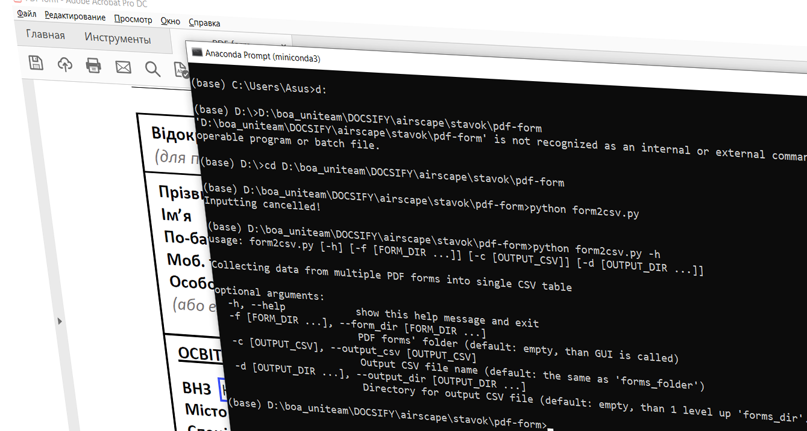

# Простий CLI + GUI для обробки PDF form

Якщо ви не хочете щоразу залазити всередину коду для налаштування вхідних параметрів, то цей матеріал саме для вас.



Взаємодія користувача з програмними продуктами чи то з власними чи то коли ви передаєте їх у спільне користування є важливою передумовою для їхнього ефективного повторного використання як для автора так інших користувачів. Для цієї взаємодії важлива наявність як інтерфейсу командного рядка (CLI) так і графічного інтерфейсу користувача (GUI). 

У нещодавній статті ["Automated processing of PDF forms"](https://oleghbond.medium.com/automated-processing-of-pdf-forms-fa635d497fc1#42a6) мною була описана реалізація утиліти для автоматизованої обробки PDF форм. Все працює начебто добре, але цьому застосунку явно бракувало простого користувацького інтерфейсу. Отже я вирішив надолужити це недопрацювання.

## Що ми хочемо побудувати

Для запуску утиліти (назвемо її `parse_cmd_line.py`) нам потрібен доволі простий інтерфейс із чотирьох вхідних параметрів: 

| Запис параметра                              | Пояснення                                                    |
| -------------------------------------------- | ------------------------------------------------------------ |
| `-h, --help`                                 | Підказка                                                     |
| `-f [FORM_DIR], --form_dir [FORM_DIR]`       | фолдер, де розміщені однотипні PDF форми                     |
| `-c [OUTPUT_CSV], --output_csv [OUTPUT_CSV]` | назва файлу CSV-таблиці, де збиратимуться значення полів заповнених форм |
| `-d [OUTPUT_DIR], --output_dir [OUTPUT_DIR]` | фолдер, де буде розміщена результуюча CSV-таблиця            |

Квадратні дужки означають необов'язковість параметра. Є дві тотжні за дією форми написання параметру: *скорочена* - з одиничним дефісом попереду і *повна* - з подвоєним дефісом попереду. Великими літерами позначені значення параметрів, що передаються на вхід утиліті. 

Сформуємо мета-код командного рядка для запуску утиліти:

```bash
> python parse_cmd_line.py [-h] [-f [FORM_DIR]] [-c [OUTPUT_CSV]] [-d [OUTPUT_DIR]]
```
Водночас ми хочемо визначати, яким інтерфейсом ми користуватимемося - CLI або GUI. Також бажано не роздмухувати кількість параметрів, щоб їх легко було запам'ятати, і мати під рукою кортоку підказку для управління запуском утиліти.

## Логіка аналізу командного рядка

Логіка аналізу командного рядка представлена у таблиці нижче. У стовпчиках 2, 3 і 4 описано як формуються значення вхідних параметрів у випадках, коли:

- параметр і значення відсутні;
- параметр є, значення відсутнє;
- параметр є, значення є.

| Параметр           | Параметр і значення <br />відсутні                           | Параметр є, <br />значення відсутнє                          | Параметр є, <br />значення є |
| ------------------ | ------------------------------------------------------------ | ------------------------------------------------------------ | ---------------------------- |
| `-f, --form_dir`   | використовуємо GUI                                           | використовуємо GUI                                           | беремо значення              |
| `-c, --output_csv` | беремо останній сегмент <br />шляху `form_dir` від <br />поділу`/` або `\` | беремо останній сегмент <br />шляху `form_dir` від <br />поділу`/` або `\` | беремо значення              |
| `-d, --output_dir` | беремо шлях на 1 рівень <br />вище за повний шлях <br />`form_dir` | використовуємо GUI                                           | беремо значення              |

До значення параметра `output_csv` додаємо розширення `.csv` у разі відсутності.

## Базис

Для побудови інтерфейсу CLI і GUI використовуємо широко відомі модулі `argparse` і `tkinter`, відповідно. Останній модуль (`tkinter`) використовується всередині мого власного невеличкого модулю `select_folder`. Докладні описи модулів можна знайти за посиланнями наприкінці статті.


```python
import argparse
import os
import re
from select_folder import select_folder
```

## Аналізатор командного рядка

Спочатку будуємо аналізатор командного рядка (*parser*). Синтаксис кожного параметру задаємо з допомогою методу `add_argument`. Для цього використовуємо конструктор `argparse.ArgumentParser`, де задаємо короткий опис через аргумент `description`.

Два перших стрінгових аргументи методу `add_argument` з одним і двома дефісами попереду задають стислий і довгий ситнаксис параметру в рядку, відповідно. При тому довга назва параметру (без дефісів) використовуватиметься в якості ключа результуючого словника. За цим ключом можна буде доступатись до значення параметру.

Значення параметрів за замовчанням задаємо з допомогою аргументу `default` методу `add_argument`.

З допомогою аргументу `nargs` визначаємо кількість значень, що можна присвоїти параметрам `form_dir` і `output_dir`. При тому, `nargs='*'` означає кількість цих значень, починаючи від 0. Набір цих значень зберігається у вигляд списку. У випадку, коли `nargs='?'`, параметру `output_csv` можна задати лише одне значення.

Аргумент `required=False` визначає необов'язковість появи параметру `form_dir` у командному рядку. Але аргумент  `required` за замовчанням має значення  `False`.


```python
def set_parser():
    parser = argparse.ArgumentParser(description='Collecting data from multiple'
                                     ' PDF forms into single CSV table')
    parser.add_argument(
        '-f',
        '--form_dir',
        default='.\\',
        nargs='*',
        required=False,
        help='PDF forms\' folder (default: empty, than GUI is called)'
    )
    parser.add_argument(
        '-c',
        '--output_csv',
        default='',
        nargs='?',
        help='Output CSV file name (default: the same as \'forms_folder\')'
    )
    parser.add_argument(
        '-d',
        '--output_dir',
        default='',
        nargs='*',
        help='Directory for output CSV file (default: empty, than 1 level up'
             ' \'forms_dir\'..)'
    )

    return parser.parse_args()
````

## Додаткова логіка

Включення складнішої логіки (як це описано вище у розділі "*Логіка аналізу командного рядка*") потребує додатково коду, що представлений у функції `fetch_cli_args`. Код розілений на три блоки - окремо для кожного параметру `form_dir`, `output_csv` і `output_dir`. Для кожного параметру проводиться аналіз щодо того:

- чи присутній взагалі параметр у командному рядку;
- якщо присутній, то чи задано значення цього параметру у командному рядку;
- якщо виконуються умови виклику GUI (див. таблицю вище у розділі "*Логіка аналізу командного рядка*"), то викликається метод `select_folder`.

Оброблені результати розміщаються у вихідному словнику:

```
{'form_dir': form_dir, 'output_csv': output_csv, 'output_dir': output_dir, 'cancelled': False}
```

Тут можна помітити додаткове поле `cancelled`, яке за звичай встановлене `False`. І лише під час вибору фолдера в графічному інтерфейсі ви вирішили відмовитись від введення, натиснувши `Cancel`, значення цього поля буде встановлено `True`. В подальшому це буде використано для припинення утиліти.

```python
def fetch_cli_args(initialdir='./'):

    parsed_cli = set_parser()
    
    # --form_dir
    # '-f' omitted or '-f' with empty str list -> GUI
    if (type(parsed_cli.form_dir) is str) or \
       len(parsed_cli.form_dir) == 0:
        title = 'Select PDF form folder'
        form_dir = select_folder(title=title, initialdir=initialdir)
        if len(form_dir) == 0: # GUI cancelled -> stop execution
            return {'cancelled': True}
    else:
        form_dir = os.path.abspath(parsed_cli.form_dir[0])
    
    # --output_csv
    if not parsed_cli.output_csv: # '-c' omitted -> 
        output_csv = os.path.basename(form_dir)
        # if 'form_dir' ends with '\' or '/' than 'output_csv' is empty string
        if not output_csv:
            # cut tailing '\' or '/'
            form_dir = re.sub('[/\\\]+$','',form_dir)
        output_csv = os.path.basename(form_dir) + '.csv'
    else:
        output_csv = parsed_cli.output_csv
        if output_csv.split('.')[-1].lower() != 'csv': 
            output_csv += '.csv'
    
    # --output_dir
    form_dir_ = '/'.join(re.split('[\\\\/]',form_dir)[:-1]) # 1 level up 'forms_dir\..'
    if len(form_dir_) == 0: # 'form_dir' is root (most upper) folder
        return {'cancelled': True}
    if type(parsed_cli.output_dir) is str: # '-o' omitted -> 1 level up 'forms_dir\..'
        output_dir = form_dir_
    elif len(parsed_cli.output_dir) == 0: # '-o' with empty str list -> GUI
        title = 'Select folder for output CSV'
        output_dir = select_folder(title=title, initialdir=form_dir_)
        if len(output_dir) == 0: # GUI cancelled -> stop execution
            return {'cancelled': True}
    else:
        output_dir = os.path.abspath(parsed_cli.output_dir[0])
    
    return {'form_dir': form_dir, 'output_csv': output_csv, 
            'output_dir': output_dir, 'cancelled': False}
```

## Фрагмент для тестування

Наприкінці модулю `parse_cmd_line.py` є фрагмент для відлагодження. Він потрібен для можливості самостійного запуску модулю з метою тестування і модифікації коду. Фрагмент представляє зразок типового використання методу `fetch_cli_args`.

```python
if __name__ == '__main__':

    import sys
    
    args = fetch_cli_args()
    
    if args['cancelled']:
        print('Inputting cancelled!')
        sys.exit()
        
    print(f'form_dir   = {args["form_dir"]}')
    print(f'output_csv = {args["output_csv"]}')
    print(f'output_dir = {args["output_dir"]}')
```

## Простий метод графічного інтерфейсу

На останок наведемо код модулю `select_folder` для створення графічного інтерфейсу, що використовується для вибору фолдеру.

```python
# Source: https://www.programcreek.com/python/?CodeExample=select+folder
# Example: 11

from tkinter import filedialog
from tkinter import Tk
    
def select_folder(title='Select folder', initialdir='.'):
    root = Tk()
    root.attributes("-topmost", True)
    root.withdraw()
    folder_path = filedialog.askdirectory(title=title, 
                                          initialdir=initialdir)
    root.destroy()
    return folder_path 

if __name__ == '__main__':
    
    sf = select_folder(initialdir='.')
    if sf:
        print(f'Selected folder:\n{sf}')
    else:
        print('Selection cancelled!')
```

## Підсумок

Зрештою маємо таку структуру програмних модулів утиліти `form2csv` включно з власними допоміжними модулями:

- [`form2csv.py`](https://github.com/protw/airscape/blob/master/stavok/pdf-form/parse_cmd_line.py) – обробка пакету однотипних PDF-форм, з розширеними коментарями українською
  - [`fetch_form_fields.py`](https://github.com/protw/airscape/blob/master/stavok/pdf-form/fetch_form_fields.py) – обробка однієї PDF-форми
  - [`parse_cmd_line.py`](https://github.com/protw/airscape/blob/master/stavok/pdf-form/parse_cmd_line.py) – аналізатор командного рядка
  - [`select_folder.py`](https://github.com/protw/airscape/blob/master/stavok/pdf-form/select_folder.py) – GUI для вибору фолдера
  - [`parse_cmd_line.md`](https://github.com/protw/airscape/blob/master/stavok/pdf-form/parse_cmd_line.md) – опис модулю `parse_cmd_line.py` українською

## Посилання

1. [Automated processing of PDF forms | by Olegh Bondarenko | Jan, 2022 | Medium](https://oleghbond.medium.com/automated-processing-of-pdf-forms-fa635d497fc1#42a6)
2. [argparse — Parser for command-line options, arguments and sub-commands — Python 3.10.2 documentation](https://docs.python.org/3/library/argparse.html#module-argparse)
3. [How to Build Command Line Interfaces in Python With argparse – Real Python](https://realpython.com/command-line-interfaces-python-argparse/#setting-whether-the-argument-is-required)
4. [tkinter — Python interface to Tcl/Tk — Python 3.10.2 documentation](https://docs.python.org/3/library/tkinter.html)
5. [python source code of select_path_dialog](https://www.programcreek.com/python/?code=deepdiy%2Fdeepdiy%2Fdeepdiy-master%2Fdeepdiy%2Futils%2Fselect_path_dialog.py)

