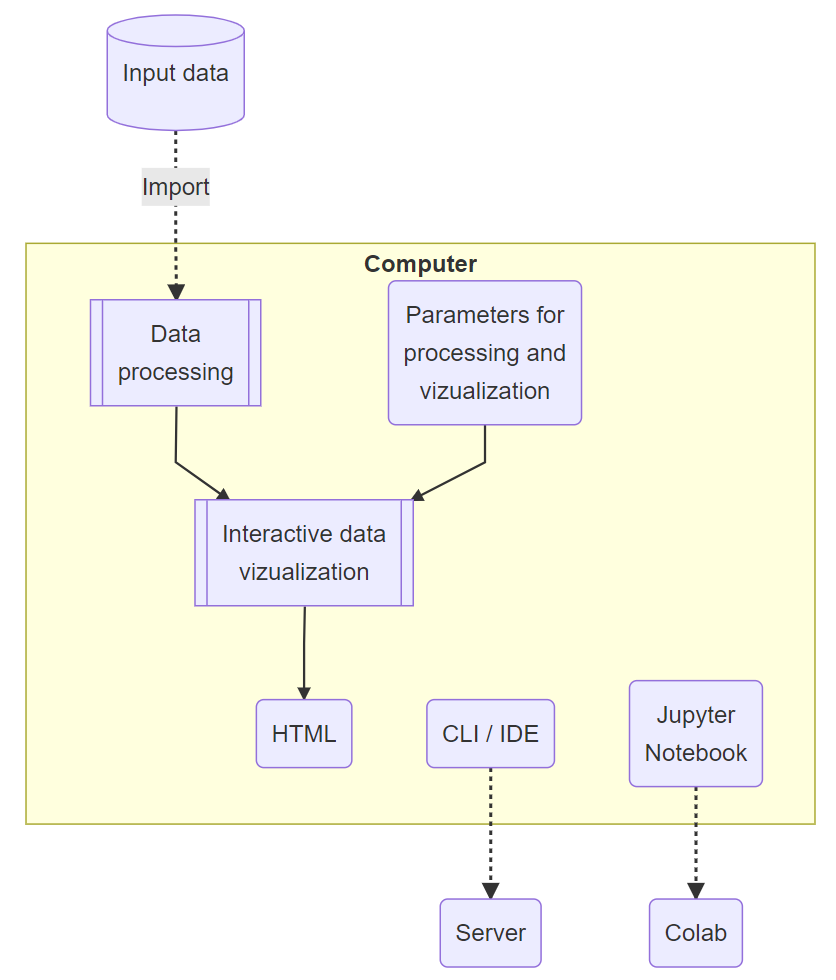
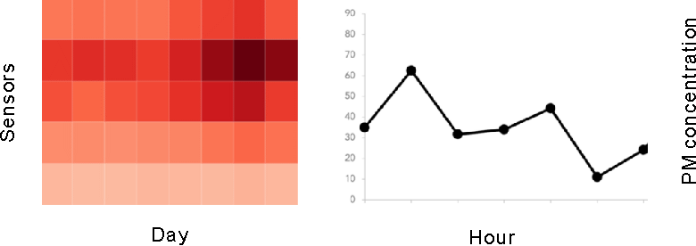
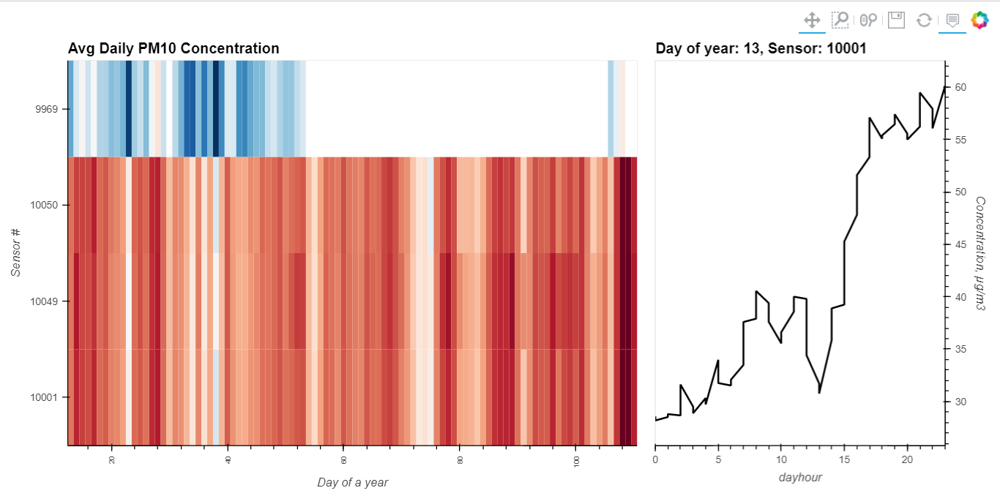

# DIY: Full cycle of data research

The ideal solution for every data researcher is to keep the full data research cycle in own hands, such as data importing, processing and researching with the help of interactive visualization with easy parameter management, and finally deploying the entire application somewhere in a remote server or cloud service.


The avalanche-like development of *Python-*based open libraries, tools, environments, etc. in recent years has actually made these dreams come true - today it is no longer a fantasy that a researcher without basic IT education is able to have designed and launch a fully fledged cycle of *Python-*based data research.

The following material is in fact a confirmation of the latter statement.

## What is it about here

TOC

## Data research cycle

Full single cycle of data research in a very general form can include, in particular, online import data from arbitrary sources, processing (this may be your model, neural network, transformer, etc.) and visual representation of data. Of course we want easy management of application processes and displaying results. In addition to the saved images for the preparation of articles, presentations and reports, we may need to present our results as an interactive application not only at own computer, but also on the outside in open web access.



Also, a researcher may often need to run own code in different environments: *Python* CLI (running *Python* from a terminal or command line), IDE (integrated shell a type of *Spyder*), *Jupyter Notebook*. In addition, the latter can be run both on your computer and on the web service *Google Colab*. Therefore, some tips of running code in these different environments that have been explored are shown below.

## What we want to build

To demonstrate the visualization, we chose the example of the HeatMap from *Holoviews* [1] (left). We want to construct the mapping so that each row of this matrix (*Y*) corresponds to a separate air quality sensor, and each column ( *X* ) corresponds to a separate observation day. The color of an individual cell (*C~D~*) should correspond to the average daily concentration of PM for a given (*X* , *Y*) (the lighter the lower the concentration). Matrix also has a certain feature - touching a certain matrix cell by the mouse invokes building of another diagram (on the right) - that is the time course of the concentration *C~H~* with 30 minute step for the chosen sensor *Y* and for the selected day *X*.

Schematic representation of our idea is shown below:



## Installing Holoviz libraries

As usual, we start with installing the necessary libraries. This is a one-time procedure. On the local computer, the installation is performed using [*conda*](https://en.wikipedia.org/wiki/Conda_(package_manager)) (before that do not forget to activate an appropriate virtual environment with *conda*) as follows:

```
> conda install -c pyviz holoviz
```

If you run the *Jupyter notebook* code in the [*colab*](https://en.wikipedia.org/wiki/Project_Jupyter#Industry_adoption) environment, the installation is performed using [*pip*](https://uk.wikipedia.org/wiki/Pip_(система_керування_пакунками)) directly from the notebook code:

```python
!pip install holoviz
```

## Importing modules

Next, importing the necessary modules:

```python
import panel as pn
import numpy as np
import holoviews as hv
from holoviews import opts
```

## Setting the server component

HoloViews supports multiple server components, namely `bokeh`, `matplotlib` and `plotly`. Depending on your preferences, you should initially set one of them:

```python
hv.extension('bokeh', width=90)
```

If all went well, then immediately after that two icons should appear – *Holoviews* and *Bokeh*:


## Displaying Holoviews charts in Colab

Playing tests with the application have shown that charts created by *Holoviews* do not appear in *Colab*.

According to the results of studying this problem the following solution was found in references [2] and [3]. As a result, insert the following lines somewhere at the beginning of the code:

```python
import os, holoviews as hv 
os.environ ['HV_DOC_HTML'] = 'true'
```

or such equivalent:

```python
%env HV_DOC_HTML=true
```

Then, for each individual block of code where the charts are generated, you will have to reload the JS as follows:

```python
hv.extension('bokeh')
# An example
hv.Curve([1, 2, 3])
```

## Description of the input data

The input data contain aerosol concentration (PM) with an interval of 30 minutes for 4 sensors located in Kyiv (Ukraine), and for 2 ranges of PM sizes: 2.5 and 10 μm. The data are taken from [the AirZOOM project](https://bit.ly/3ExKKm3) and cover the period of forest fires in the Chornobyl Exclusion Zone (130 km north of Kyiv) in early 2020.

## Reading the input data

In this example, for simplicity we use a pre-prepared [CSV file](https://raw.githubusercontent.com/protw/airscape/master/data/200421 Chronograf Data.csv) . Although for other projects more comprehensive APIs with other database platforms can be used.

```python
import pandas as pd
from datetime import datetimedef read_data():
    data_file='https://raw.githubusercontent.com/protw/airscape/'+\
              'master/data/200421%20Chronograf%20Data.csv'
    df = pd.read_csv(data_file)
    df.time = [datetime.strptime(x[0:19],'%Y-%m-%dT%H:%M:%S') \
               for x in df.time]
    df['dayhour'] = [x.hour for x in df.time]
    df['weekday'] = [x.weekday() for x in df.time]
    df['monthday']= [x.day for x in df.time]
    df['yearday'] = [x.timetuple().tm_yday for x in df.time]
    df['yearweek']= [x.isocalendar()[1] for x in df.time] 
    df['month']   = [x.month for x in df.time] 
    df['year']    = [x.year for x in df.time]
    df.sensor_id  = [str(x) for x in df.sensor_id]
    return df
    
df = read_data()
```

In addition to reading the data, we generate several (date-time-derived) columns that may be needed for further analysis and charts construction:

- `dayhour` - hour of day;
- `weekday` - weekday;
- `monthday` - day of month;
- `yearday` - day of year;
- `yearweek` - week of year;
- `month` - month;
- `year` - year.

Let's look at the result of reading the input data:

```
df
```


38016 rows × 11 columns

## Dataset definition

Let's assign independent (`kdims`) and dependent (`vdims`) variables in our dataset, which we are going to use for building our diagrams. The meaning of this assignment is quite clear - it `vdims`depends on `kdims`. Each variable is specified by a tuple containing two values, for example:

- `('sensor_id','Sensor #')`: `sensor_id` – name of the data column (variable), `Sensor #` – readable text used for this variable, particularly, in captions of axes in diagrams.

```python
dataset = hv.Dataset(df, 
                     kdims=[('sensor_id','Sensor #'),
                            ('yearday','Day of a year'),
                            ('dayhour','Hour of a day'),
                            ('factor','Pollution factor')],
                     vdims=('val','Concentration, µg/m3'))
```

## Descriptive data statistics

To build charts, we will need some parameters of the  dataset, such as maximum and maximum values, etc.:

```python
xmin = df.yearday.min()
xmax = df.yearday.max()
ymin = df.sensor_id.min()
factors = df.factor.unique()
factor = factors[0] # Later this will be substituted by UI
```

## Declaration of two charts

```python
hv.extension('bokeh')## Declare HeatMap

heatmap = hv.HeatMap(dataset.aggregate(['yearday', 'sensor_id'],\
          np.mean), label=f'Avg Daily {factor} Concentration'). \
          select(yearday=(xmin, xmax))

## Declare Tap stream with heatmap as source and initial values
posxy = hv.streams.Tap(source=heatmap, x=xmin, y=ymin)

## Define function to compute histogram based on tap location
def tap_histogram(x, y):
    return hv.Curve(dataset.select(sensor_id=y, yearday=int(x), \
           factor=factor), kdims='dayhour', \
           label=f'Day of year: {int(x)}, Sensor: {y}')

## Connect the Tap stream to the tap_histogram callback
tap_dmap = hv.DynamicMap(tap_histogram, streams=[posxy])

## Get the range of the aggregated data we're using for plotting
cmin, cmax = dataset.aggregate(['yearday', 'sensor_id'], \
             np.mean).range(dim='val')
```

## Displaying charts

The following code is responsible for displaying the HeatMap (on the left) and the time course of the concentration during the day (on the right) in one row:

```python
hv.extension('bokeh')
heatmap_tap_dmap = heatmap + tap_dmap
(heatmap_tap_dmap).opts(
    opts.Curve(framewise=True, height=500, line_color='black', \
               width=375, yaxis='right'),
    opts.HeatMap(clim=(cmin, cmax), cmap='RdBu_r', \
                 fontsize={'xticks': '6pt'}, height=500, \
                 logz=True, tools=['hover'], width=700, \
                 xrotation=90))
```

If all went well, you will get the following chart (unlike in this article, the chart will be interactive):



### Display on local computer

This code immediately gives the result in the *Jupyter notebook*, but nothing is displayed when running it in [*Spyder*](https://en.wikipedia.org/wiki/Spyder_(software)). The problem is solved with the help of commentary [4] in the following way.

```python
import panel as pnbokeh_server = pn.Row(heatmap_tap_dmap).show(port=12346)
```

To stop the server then, if necessary, run the following command in *Python* :

```python
bokeh_server.stop()
```

## Run the application as a server

To run the web application as a server, type the following at a command prompt:

```
> panel serve Tap_air_local.py
```

Here `Tap_air_local.py`is the name of our *Python* code , which includes all the steps outlined above. As the *Panel* works with *Jupyter notebooks*, you can run this command as: `panel serve Tap_air_local.ipynb`.

You will then be prompted to go to the browser and launch the HTML page of your web app from the web address bar:

```
http://localhost:5006/Tap_air_local
```

### Command script

We can combine these actions into a single command scenario. Let's call it `Tap_air_local.bat` (it's for Windows) and place this file next to the main code file `Tap_air_local.py`. For Windows 10, this script will look like this:

```
call C:\Users\<user_name>\miniconda3\Scripts\activate.bat <env_name>
call panel serve Tap_air_local.py > nul | Tap_air_local_Link.url
```

where:

- `<user_name>` - your Windows 10 username on your local computer
- `<env_name>`- the *Python Anaconda* virtual environment name of your web application;
- `Tap_air_local_Link.url`- this label file for Windows, which contains the local web address for running the program: http://localhost:5006/Tap_air_local.

> **Warning!** When creating a label file for Windows, specify it without an extension `.url` -  just `Tap_air_local`. The extension is really hidden and is added to the file automatically. 
>
> **Note.** You can easily change this command script for another operating system.

After that, you just need to run `Tap_air_local.bat` in the terminal (command line) or double-click it in the File Explorer:

```
> Tap_air_local
```

## What's next

A server that we can easily run on our own computer is fine if you have your own 24/7/365 operating server or proper access to your organization's server. For most, this is not the solution. Therefore, the next task is to deploy the application on cloud services. An example of such a deployment is given here:

* [Deploying Panel (Holoviz) dashboards using Heroku Container Registry | by Ali Shahid | Towards Data Science](https://towardsdatascience.com/deploying-panel-holoviz-dashboards-using-heroku-container-registry-5221eb0538ba)

## References

1. http://holoviews.org/reference/streams/bokeh/Tap.html
2. https://stackoverflow.com/a/55514087
3. https://stackoverflow.com/a/55507337
4. https://stackoverflow.com/a/57971346

Jupyter Notebook with this code for *Colab*:

5. https://github.com/protw/airscape/blob/master/stavok/Tap_air_colab.ipynb

The same *Python* code for CLI / IDE:

6. https://github.com/protw/airscape/blob/master/stavok/Tap_air_local.py

## Tags

`Python`
`Web App Development`
`Data Science`
`Data Visualization`

