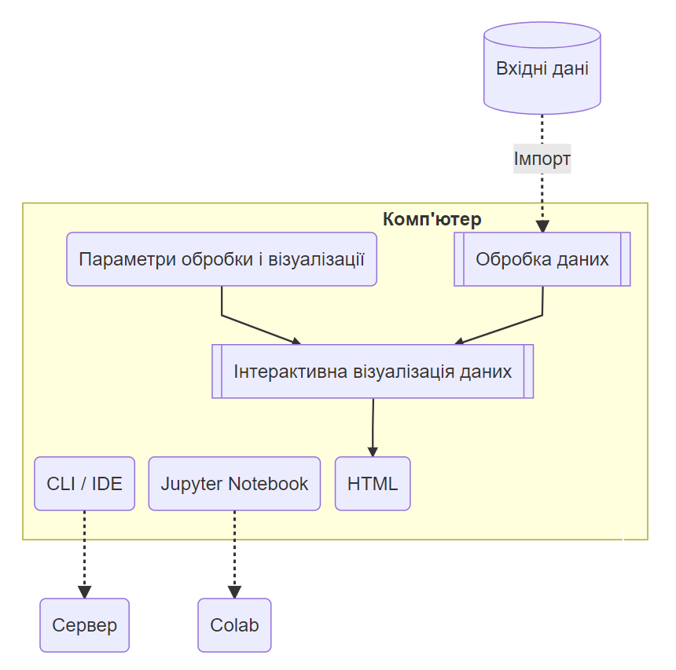
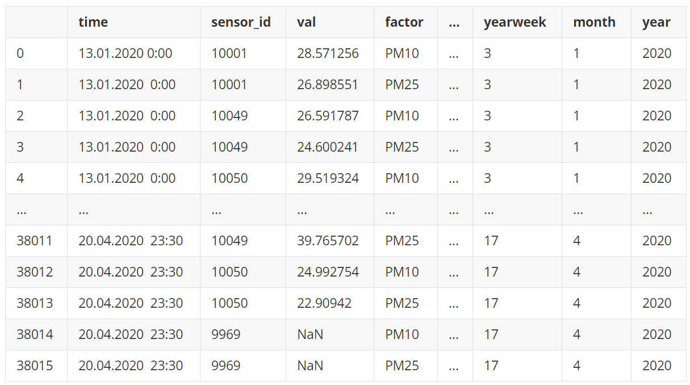
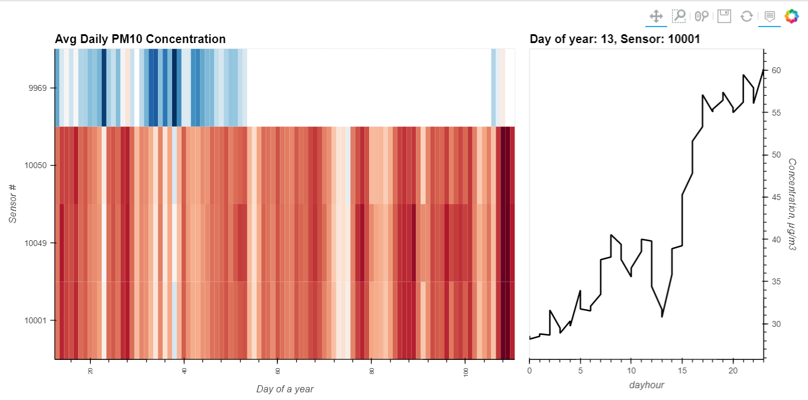

# Повний цикл дослідження даних власноруч

Ідеальним рішенням, якого прагне кожен дослідник даних – зручно і легко тримати повний цикл дослідження даних у власних руках, як-то: імпорт даних, обробка і дослідження даних, інтерактивна візуалізація зі зручним управлінням параметрами і, нарешті, розгортання всього застосунку десь на зовнішньому севері або хмарному сервісі.

Лавиноподібний розвиток останніх років відкритих бібліотек, інструментів, середовищ тощо на базі *Python* фактично призвів до реалізованості цих прагнень - на сьогодні це вже не фантастика, що дослідник без базової ІТ освіти в стані запустити повний цикл дослідження даних власноруч.

Представлений нижче матеріал є власне підтвердженням останнього твердження.

## Цикл дослідження даних

Повний одиночний цикл дослідження данних у дуже загальному вигляді включає, зокрема, онлайн імпорт даних з довільних джерел, обробку даних (це може бути ваша модель, нейромережа, перетворювач, інше) і візуальне представлення даних. Звичайно ми хочемо зручного управління процесами застосунку і параметрами відображення результатів. Окрім збережених зображень для підготовки статей, презентацій та звітних матеріалів у нас є потреба виставити наші результати у вигляді інтерактивного застосунку не лише на власному комп'ютері, але і на зовні у відкритому веб-доступі.



Також у дослідника часто може виникати потреба запускати свій код в різних середовищах: *Python* CLI (запуск *Python* з терміналу або командного рядка), IDE (інтегрована оболонка типу *Spyder*), блокнот *Jupyter* (*Jupyter Notebook*). До того ж останній можна запускати як на своєму комп'ютері, так і на веб-сервісі *Google Colab*. Тому, деякі тонкощі запуску коду у цих різних середовищах, що вдалося дослідити, відображені тут нижче. 

## Що ми хочемо побудувати

Для демонстрації візуалізації ми обрали приклад Температурної мапи (HeatMap) з Holoviews [1] (ліворуч). Ми хочемо побудувати відображення таким чином, щоб кожний рядок цієї матриці (*Y*) відповідав окремому датчику якості повітря, а кожний стовпчик (*X*) – окремому дню спостереження. Колір окремої клітинки (*C~D~*) має відповідати середньодобовій концентрації PM для заданих (*X*, *Y*) (що світліше, то менше концентрація). Також матриця має таку властивість - після дотику миши вибудовує іншу діаграму (праворуч) - часовий хід концентрації *C~H~* з кроком 30 хвилин обраного сенсора *Y* впродовж обраної доби *X*.

Нижче на рисунку надано схематичне зображення нашого задуму 


## Установка бібліотек Holoviz

Як і зазвичай починаємо зі встановлення необхідних бібліотек. Це одноразова процедура. На локальному комп’ютері встановлення проводиться з допомогою [*conda*](https://en.wikipedia.org/wiki/Conda_(package_manager)) (не забудьте перед тим активувати з допомогою *conda* належне середовище) наступним чином:

```
    > conda install -c pyviz holoviz
```

У разі запуску коду блокноту *Jupyter* в середовищі [*colab*](https://en.wikipedia.org/wiki/Project_Jupyter#Industry_adoption) встановлення проводиться з допомогою [*pip*](https://uk.wikipedia.org/wiki/Pip_(система_керування_пакунками)) безпосередньо з коду блокноту:

```python
    !pip install holoviz
```

## Імпортуємо модулі

Далі встановлюємо необхідні модулі:


```python
import panel as pn
import numpy as np
import holoviews as hv
from holoviews import opts
```

## Встановлення серверної компоненти

HoloViews підтримує декілька серверних компонент, а саме: `bokeh`, `matplotlib` та `plotly`. В залежності від ваших преференцій ви на початку маєте встановити одну з них:

```python
hv.extension('bokeh', width=90)
```

Якщо все пройшло гаразд, то одразу після цього мають з'явитися дві іконки: Holoview і Bokeh:


## Відображення діаграм Holoview в Colab

Під час випробувань застосунку з'ясувалось, що діаграми, створені Holoview, не відображаються у Colab. 

За результатами вивчення цієї проблеми вдалося знайти її вирішення, що наведено за посиланнями [2] і [3]. В підсумку запропоновано таке: 

Десь на початку коду вставити такі рядки:

```python
import os, holoviews as hv
os.environ['HV_DOC_HTML'] = 'true'
```

або такий еквівалент:

```python
%env HV_DOC_HTML=true
```

Потім для кожного окремого блоку коду блокноту, де генеруються діаграми, вам доведеться повторно завантажити JS таким чином:

```python
hv.extension('bokeh')
# An example
hv.Curve([1, 2, 3])
```

## Опис вхідних даних

Дані містять концентрацію аерозолю (PM) з інтервалом 30 хвилин для 4 датчиків, розташованих у місті Києві (Україна), і для 2 діапазонів розмірів PM: 2,5 і 10 мкм. Дані взяті з [проекту AirZOOM](https://bit.ly/3ExKKm3) і охоплюють період лісових пожеж у Чорнобильській зоні відчуження (130 км на північ від Києва) на початку 2020 року. 

## Читаємо вхідні дані

У даному прикладі ми використовуємо заздалегідь підготовлений [CSV-файл](https://raw.githubusercontent.com/protw/airscape/master/data/200421%20Chronograf%20Data.csv). Хоча для інших проєктів можуть бути використані API з іншими типами баз даних.

```python
import pandas as pd
from datetime import datetime

def read_data():
    data_file = 'https://raw.githubusercontent.com/protw/airscape/master/' + \
                'data/200421%20Chronograf%20Data.csv'
    df = pd.read_csv(data_file)
    df.time = [datetime.strptime(x[0:19],'%Y-%m-%dT%H:%M:%S') for x in df.time]
    df['dayhour'] = [x.hour for x in df.time]
    df['weekday'] = [x.weekday() for x in df.time]
    df['monthday']= [x.day for x in df.time]
    df['yearday'] = [x.timetuple().tm_yday for x in df.time]
    df['yearweek']= [x.isocalendar()[1] for x in df.time] 
    df['month']   = [x.month for x in df.time] 
    df['year']    = [x.year for x in df.time]
    df.sensor_id  = [str(x) for x in df.sensor_id]
    return df

df = read_data()
```

Окрім зчитування  даних згенеруємо декілька (похідних від часу) стовпців, що можуть знадобитися для подальшого аналізу і побудови діаграм:

- `dayhour` - година доби;
- `weekday` - день тижня;
- `monthday` - день місяця;
- `yearday` - день року;
- `yearweek` - тиждень року
- `month` - місяць
- `year` - рік

Переглянемо результат зчитування вхідних даних:

```python
df
```



38016 rows × 11 columns

## Призначення набору даних

Призначимо незалежні (`kdims`) і залежні (`vdims`) змінні в нашому наборі даних. Зміст цього призначення доволі зрозумілий - `vdims`  залежить від `kdims`. Кожна змінна задається кортежем, що містить два значення, наприклад:

- `('sensor_id','Sensor #')`: `sensor_id` - назва стовпця даних,  `Sensor #` - читабельний текст, що використовується, зокрема, у підписах осей на діаграмах.


```python
dataset = hv.Dataset(df, 
                     kdims=[('sensor_id','Sensor #'),
                            ('yearday','Day of a year'),
                            ('dayhour','Hour of a day'),
                            ('factor','Pollution factor')],
                     vdims=('val','Concentration, µg/m3'))
```

## Дескриптивна статистика даних

Для побудови діаграм нам будуть потрібні деякі параметри набору даних, як-то, наприклад, максимальні та максимальні значення тощо:


```python
xmin = df.yearday.min()
xmax = df.yearday.max()
ymin = df.sensor_id.min()
factors = df.factor.unique()
factor = factors[0] # Later this will be substituted by UI
```

## Оголошення двох діаграм

```python
hv.extension('bokeh')

## Declare HeatMap
heatmap = hv.HeatMap(dataset.aggregate(['yearday', 'sensor_id'], np.mean),
      label=f'Avg Daily {factor} Concentration').select(yearday=(xmin, xmax))

## Declare Tap stream with heatmap as source and initial values
posxy = hv.streams.Tap(source=heatmap, x=xmin, y=ymin)

## Define function to compute histogram based on tap location
def tap_histogram(x, y):
    return hv.Curve(dataset.select(sensor_id=y, yearday=int(x), factor=factor), 
                    kdims='dayhour', label=f'Day of year: {int(x)}, Sensor: {y}')

## Connect the Tap stream to the tap_histogram callback
tap_dmap = hv.DynamicMap(tap_histogram, streams=[posxy])

## Get the range of the aggregated data we're using for plotting
cmin, cmax = dataset.aggregate(['yearday', 'sensor_id'], np.mean).range(dim='val')
```

## Відображення діаграм

Наступний код відповідає за відображення Температурної мапи і часового ходу концентрації впродовж доби в один ряд:


```python
hv.extension('bokeh')
heatmap_tap_dmap = heatmap + tap_dmap
(heatmap_tap_dmap).opts(
    opts.Curve(framewise=True, height=500, line_color='black', width=375, 
               yaxis='right'),
    opts.HeatMap(clim=(cmin, cmax), cmap='RdBu_r', fontsize={'xticks': '6pt'}, 
             height=500, logz=True, tools=['hover'], width=700, xrotation=90))
```

Якщо все гаразд, то ви отримаєте таку діаграму (на відміну від цієї статті діаграма буде інтерактивна):




### Відображення на локальному комп'ютері

Цей код одразу дає результат у блокноті *Jupyter*, але під час запуску в [*Spyder*](https://en.wikipedia.org/wiki/Spyder_(software)) нічого не відображається. Проблема вирішується з допомогою коментаря [4].

```python
import panel as pn

bokeh_server = pn.Row(heatmap_tap_dmap).show(port=12346)
```

Щоб зупинити сервер, якщо необхідно, виконайте таку команду в *Python*:

```python
bokeh_server.stop()
```

## Запускаємо застосунок на сервері

Щоб запустити веб-додаток як сервер, введіть у командному рядку наступне:

```
> panel serve Tap_air_local.py
```

Тут `Tap_air_local.py` - це назва нашого коду *Python*, що включає всі дії, викладені вище. Оскільки *Panel* працює і з блокнотами Jupyter, ви можете виконати цю команду так само: `panel serve Tap_air_local.ipynb`.

Після цього вам буде запропоновано перейти до бравзера і запустити програму з рядка веб-адреси:

```
http://localhost:5006/Tap_air_local
```

#### Командний сценарій

Ми можемо об’єднати ці дії в єдиний командний сценарій. Назвемо його `Tap_air_local.bat` (це для Windows) і розмістимо цей файл біля основного файлу коду `Tap_air_local.py`. Для Windows 10 цей скрипт матиме такий вигляд:

```
call C:\Users\<user_name>\miniconda3\Scripts\activate.bat <env_name>
call panel serve Tap_air_local.py > nul | Tap_air_local_Link.url
```

де:

- `<user_name>` - ваше ім'я користувача в Windows 10 на вашому локальному комп'ютері;
- `<env_name>` - назва середовища *Python Anaconda* вашого веб-застосунку;
- `Tap_air_local_Link.url` - цей файл ярлика для Windows, що містить локальну веб-адресу для запуску програми: http://localhost:5006/Tap_air_local.

> **Увага!** Створюючи файл ярлика для Windows, зазначте його без розширення `.url` - просто `Tap_air_local`. Розширення дійсно приховане і додається до файлу автоматично. Ви можете легко змінити цей командний сценарій для іншої операційної системи.

Після цього вам просто потрібно запустити `Tap_air_local.bat` в терміналі (командному рядку) або двічі клацнути його у Провіднику файлів:

```
> Tap_air_local
```

## Що далі

Сервер, що ми легко запустили на власному комп'ютері, це добре, якщо у вас є власний постійно працюючий сервер або доступ до серверу вашої організації. Для більшості це не є рішенням. Тому наступним заданням є розгортання застосунку на хмарних сервісах. Приклад такого розгортання наведений тут:

* [Deploying Panel (Holoviz) dashboards using Heroku Container Registry | by Ali Shahid | Towards Data Science](https://towardsdatascience.com/deploying-panel-holoviz-dashboards-using-heroku-container-registry-5221eb0538ba)

## Посилання

1. Приклад HeatMap Tap http://holoviews.org/reference/streams/bokeh/Tap.html
2. Вирішення проблеми відображення діаграм Holoview в Colab https://stackoverflow.com/a/55514087
3. Вирішення проблеми відображення діаграм Holoview в Colab https://stackoverflow.com/a/55507337
4. Вирішення проблеми відображення діаграм Holoview у CLI / IDE https://stackoverflow.com/a/57971346

**Блокнот *Jupyter* із цим кодом для *Colab*:**

5. https://github.com/protw/airscape/blob/master/stavok/Tap_air_colab.ipynb

**Той же самий *Python* код для CLI / IDE:**

6. https://github.com/protw/airscape/blob/master/stavok/Tap_air_local.py

## Tags

`Python`
`Web App Development`
`Data Science`
`Data Visualization`
